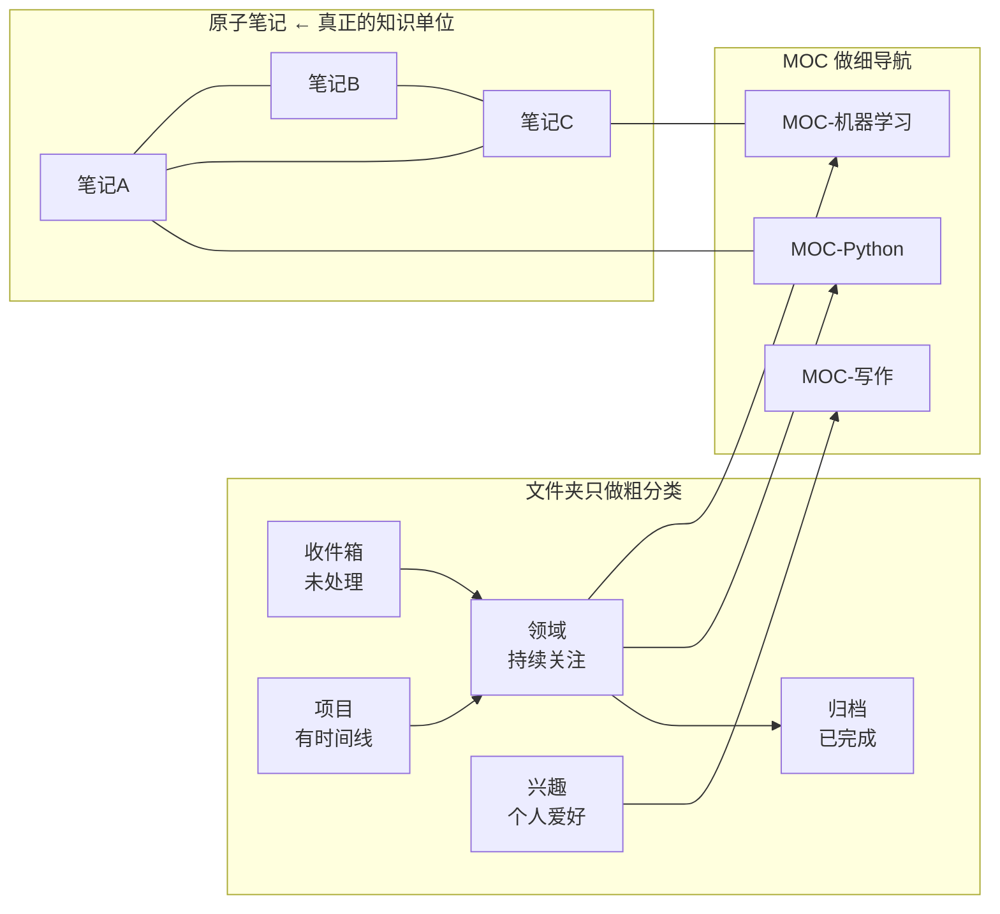

# Obsidian 完美使用工作流

> 将 [[Obsidian知识管理的底层逻辑]] 中的 7 条原则，转化为**每天可执行的具体操作**。

---

## 0. 总览：一图看懂完整工作流

```
收件箱（每日收集）
    │
    ▼
短期处理（每天 5 分钟）
    │
    ├── 能原子化 → 写成独立笔记 + 加链接
    ├── 暂时没用 → 留收件箱，一周后删除
    └── 需要行动 → 转移到任务管理
    │
    ▼
长期生长（每周 10 分钟）
    │
    ├── 建立/更新 MOC
    ├── 检查孤岛笔记并建立链接
    └── 审视图谱，发现意外连接
    │
    ▼
知识输出（每月一次）
    │
    └── 基于链接网络写文章、做项目
```

---

## 第一章：日常输入规范（第 1 ~ 5 分钟）

### 1.1 收件箱：零阻力捕获

在 Vault 根目录建一个 `📥 收件箱/` 文件夹，或使用每日笔记。

```markdown
# 每日笔记 2026-07-12

## 📥 闪念
- 刚才想到可以用 HuggingFace pipeline 做文本分类
- 读完那篇关于 RAG 的文章，核心要点是...
- 想试一下 LangChain 的 LCEL 语法

## 待处理
%% 每天结束时过一遍，决定这些项目去哪里 %%
```

**原则**：
- 不要求格式完美
- 不纠结放哪个文件夹
- 不打断当前思路
- **先捕获，后整理**

### 1.2 三种笔记类型的选择

| 类型 | 用途 | 长度 | 链接密度 | 例子 |
|------|------|:----:|:--------:|------|
| **原子笔记** 🌱 | 记录一个概念/想法 | 短（一段~一屏） | ⭐⭐⭐ | [[自注意力机制]] |
| **MOC** 🗺️ | 索引和导航 | 中（一屏） | ⭐⭐⭐⭐⭐ | [[MOC-深度学习]] |
| **临时笔记** 📥 | 未经处理的原始想法 | 不定 | ⭐ | 每日笔记中的闪念 |

**什么时候用什么？**

| 场景 | 用 |
|------|----|
| 学到一个新概念 | **原子笔记** |
| 某主题超过 5 篇笔记 | **MOC** |
| 突然想起一件事，没想好怎么归类 | **每日笔记/收件箱** |
| 已有的多个概念能连起来了 | **原子笔记之间加链接，或建 MOC** |

---

## 第二章：记笔记的黄金法则

### 2.1 原子笔记的写作规范

#### 标题规则

```markdown
# 自注意力机制          ← 明确的概念名，不用编号
# 第3章-神经网络        ❌ 不要用书本章节号（换个上下文就失效）
# Python笔记            ❌ 太宽泛，不是原子化
```

#### 内容结构

```markdown
# 自注意力机制

## 一句话定义
自注意力机制是一种让模型在处理序列时，关注序列中**不同位置**之间关系的技术。

## 核心直觉
- 不是只看当前词，而是看**所有词**对当前词的影响
- 权重由当前词和其他词的「相似度」决定

## 与相关概念的关系
- [[注意力机制]] ← 自注意力是注意力的一种特殊情况
- [[Transformer架构]] ← 自注意力是 Transformer 的核心组件
- [[RNN]] ← 自注意力解决了 RNN 无法并行的问题

## 我的理解
%% 用自己的话写一遍，不复制原文 %%
自注意力就像你在读一句话时，虽然一个字一个字看，
但你其实在用「余光」扫视前后文，来判断当前字的意思。
```

**关键规则**：

| 要求 | ✅ 应该 | ❌ 不应该 |
|------|--------|----------|
| **用自己的话** | 关上原文，重新解释 | 直接复制粘贴 |
| **加链接** | 至少 3 个 `[[]]` 链接 | 孤立笔记，跟谁都不连 |
| **一个概念** | 只讲自注意力 | 掺杂 CNN、LSTM 等其他概念 |
| **可独立理解** | 脱离上下文也读得懂 | 「如上所述」「详见前文」 |

### 2.2 链接的最佳实践

#### 在正文中自然嵌入

```markdown
# 好写法
Transformer 使用 [[自注意力机制]] 而不是 [[RNN]]，
这使得训练可以 [[并行计算]]，大幅提升了效率。

# 不好写法（为了链接而链接）
Transformer 使用自注意力机制。
[[RNN]]
[[并行计算]]
```

**链接应该是句子中自然的一部分，而不是笔记末尾的列表。**

#### 笔记底部的「相关链接」区块

```markdown
---
## 🔗 相关笔记
- [[自注意力机制]] ← 核心概念
- [[Transformer架构]] ← 所属体系
- [[位置编码]] ← 配套技术
- [[MOC-深度学习]] ← 所属 MOC
```

### 2.3 避免的坏习惯

| ❌ 坏习惯 | 为什么 | ✅ 替代方案 |
|-----------|--------|------------|
| 把笔记当剪报/收藏夹 | 没有经过大脑加工，学了等于没学 | 用自己的话重写一遍 |
| 追求完美格式才保存 | 写笔记的心理成本太高，导致不写 | 允许草稿状态，用 `%%待完善%%` 标记 |
| 不给链接 | 笔记成了孤岛，图谱上一颗孤零零的点 | 至少 3 个链接 / 篇 |
| 链接只指向文件夹 | 文件夹链接在图谱中显示为群组，不精确 | 链接到具体笔记，不是 `[[]]` 到 `path:` |
| 花大量时间美化排版 | 排版不是知识 | 内容到位就行，Obsidian 读取没问题 |

---

## 第三章：每日/每周维护节奏

### 3.1 每天 5 分钟：收件箱清空

```
打开 📥 收件箱/ 或昨日每日笔记
对每条闪念：

┌──────────────────────────────────────┐
│ 问自己三个问题：                      │
│                                      │
│ ① 这是一个值得保留的知识点吗？→ 否 → ❌ 删除  │
│                       → 是 → 下一步        │
│                                      │
│ ② 现有笔记中是否有相关内容？→ 有 → 加链接     │
│                          → 无 → 新建原子笔记  │
│                                      │
│ ③ 是否需要后续行动？→ 是 → 加待办        │
│                    → 否 → 完成           │
└──────────────────────────────────────┘
```

### 3.2 每周 10 分钟：图谱与孤岛检查

#### 检查 1：孤岛笔记

在搜索框输入：

```
-path:📥  -path:模板  -path:附件
```

然后在图形视图中观察：
- 孤立节点（没有连线）→ 手动建立至少 2 个链接
- 连了 1 条的 → 再连 1~2 条
- 高密度节点 → 考虑是否需要拆成 MOC

#### 检查 2：MOC 更新

```
打开你的 MOC 列表
→ 本周有没有新笔记需要加到某个 MOC 中？
→ 某个 MOC 超过一屏了？考虑拆分成子 MOC
→ 相关 MOC 之间有没有建立互链？
```

#### 检查 3：图谱发现

打开全局图谱，用 `path:` 过滤到你的活跃文件夹。
观察：
- 哪些笔记之间连线密集 → 说明你理解得深
- 哪两个簇之间没有任何连接 → 考虑是否需要打通

### 3.3 每月一次：知识输出

> **知识管理的尽头是输出。**

基于你的笔记网络，做一件事：

```markdown
✅ 写一篇文章
  从 MOC 中选取 3~5 篇原子笔记，串联成一篇文章
  例子：基于 [[自注意力机制]] + [[Transformer]] + [[BERT]]
        写一篇《从注意力机制到预训练模型》

✅ 做一个项目
  把笔记中的知识转化为代码/作品/方案
  例子：基于 RAG 相关笔记搭建一个问答系统

✅ 做一次分享
  用自己的话给别人讲一次，是最好的查漏补缺
```

**输出本身就是最好的知识检验**——你会发现哪些概念你其实没真懂，哪些链接是虚的。

---

## 第四章：文件夹结构的最佳实践

### 4.1 推荐结构

```
📁 Vault 根目录
│
├── 📁 00-收件箱/         ← 未处理的闪念、临时笔记
├── 📁 10-项目/           ← 有明确完成目标的短期任务
├── 📁 20-领域/           ← 持续关注的领域（工作/学习）
├── 📁 30-兴趣/           ← 个人兴趣
├── 📁 40-归档/           ← 已完成/不再活跃的笔记
│
├── 📁 90-MOCs/           ← 统一存放所有 MOC
│   ├── MOC-机器学习.md
│   ├── MOC-Python学习.md
│   └── ...
│
├── 📁 附件/              ← 图片、PDF 等
├── 📁 模板/              ← 笔记模板
└── 📁 .obsidian/         ← Obsidian 配置（自动生成）
```

### 4.2 为什么这样设计？



**文件夹只决定「笔记的生命周期阶段」，不决定「笔记的主题归属」**——后者交给 MOC 和链接。

### 4.3 给你的文件夹起名规则

| 好的命名 | 不好的命名 |
|---------|-----------|
| `10-收件箱`（带编号控制排序） | `杂项`（不知道里面有什么） |
| `20-领域/Python`（清晰） | `学习笔记`（太宽泛） |
| `90-MOCs`（统一放一处） | `MOC-机器学习`（MOC 散落在各地难管理） |

使用数字前缀可控制排序：00 最先显示，90 最后显示。

---

## 第五章：四两拨千斤的核心插件

> 以下插件推荐基于「符合底层逻辑」筛选——帮你更高效地实践上文的原则，而不是偏离它们。

### 核心插件（内置，开箱即用）

| 插件 | 用途 | 对应原则 |
|------|------|---------|
| **反向链接面板** | 看到谁引用了当前笔记 | ④ 双向链接触发意外发现 |
| **出链预览**（悬停预览） | 不跳转也能看链接内容 | ① 鼓励大胆使用链接 |
| **模板** | 创建笔记模板，降低写作阻力 | ⑤ 写就是思考——减少格式负担 |
| **日记** | 每日闪念的入口 | ⑤ 渐进式学习——允许粗糙的开始 |
| **标签列表** | 辅助发现同类笔记 | ④ 发现连接 |

### 社区插件（根据需求选装）

| 插件 | 功能 | 安装理由 |
|------|------|---------|
| **Dataview** | 用 SQL-like 查询自动生成列表 | MOC 中嵌入动态查询，减少手动维护 |
| **Templater** | 比内置模板更强大，支持脚本 | 自动插入日期、标签、链接 |
| **Quick Add** | 快速捕获各种类型的笔记 | 降低收件箱输入阻力 |
| **Graph Analysis** | 增强图谱分析 | 比原生图谱更精细地发现孤岛和簇 |
| **ExcaliBrain** | 以思维导图展示知识网络 | 视觉化「自下而上」的结构生长过程 |

> **规则**：插件是为了更好地实践原则而服务的。如果一个插件让你偏离了原子笔记、链接、自下而上这些原则——卸载它。

---

## 第六章：从 0 到 1 的落地路线图

### 第 1 周：建立习惯

```
Day 1-2:  只有收件箱。任何想法先扔进去。
Day 3-4:  每天清理收件箱，尝试建 2 篇原子笔记 + 加链接。
Day 5-7:  在笔记底部加「相关笔记」区块，养成加 `[[]]` 的肌肉记忆。
```

**不必做**：不用管文件夹结构，不用管 MOC，不用管图谱。

### 第 2 周：引入结构

```
建立简单的文件夹结构（00-收件箱 / 20-领域 / 90-MOCs）
当某个主题积累了 5 篇笔记，建第一个 MOC
开始在每周固定时间检查孤岛笔记
```

### 第 3~4 周：完整工作流运转

```
每日收件箱清理已成习惯
MOC 增加到 2~3 个
开始注意图谱中的连接模式
尝试基于笔记写一篇输出（文章/项目/分享）
```

### 第 2 个月及以后

```
MOC 体系初步成型
反向链接开始频繁带给你「意外发现」
文件夹结构趋于稳定，几乎不需要改动
知识管理从「刻意练习」变成了「自然习惯」
```

---

## 第七章：常见误区与纠偏

| 误区 | 表现 | 纠偏 |
|------|------|------|
| **收集癖** | 笔记越来越多，但从不回看 | 定期清理收件箱，不做剪报 |
| **结构焦虑** | 花大量时间调整文件夹 | 文件夹只分生命周期，主题交给 MOC 和链接 |
| **链接恐惧** | 怕链接乱了，所以不链接 | 链接越多越好，反正不会断（即使目标笔记不存在） |
| **一次性完美** | 写一篇笔记要半小时，导致不想写 | 允许草稿，用 `%%待完善%%` 标记 |
| **插件上瘾** | 装了几十个插件，偏离笔记本质 | 插件为原则服务，不满足就卸载 |
| **过度原子化** | 一篇笔记只有一句话，失去上下文 | 原子笔记足够独立理解即可，不是越短越好 |
| **忽视输出** | 只有输入没有产出 | 每月至少基于笔记做一次输出 |

---

## 附：一键自检清单

> 每周花 1 分钟过一遍，看看是否偏离了轨道。

```
□ 这周写了多少篇新笔记？
□ 每篇笔记是否有至少 2 个 `[[]]` 链接？
□ 收件箱是否清空（或接近清空）？
□ 是否有新的孤岛笔记需要链接？
□ MOC 是否需要更新？
□ 有没有哪个链接带来了「意外发现」？
□ 这周有输出吗？（文章/代码/分享）
```

**如果以上 7 个问题你都能答「是」，说明你的 Obsidian 使用方式完全符合它底层的知识管理逻辑。** 🎉

---

## 🔗 关联笔记

- [[Obsidian知识管理的底层逻辑]] ← 理论基础
- [[MOC-内容地图完全指南]] ← MOC 实操
- [[AI使用者Python基础调研报告]] ← 在这个框架下的实际应用案例
- [[Obsidian限定文件夹知识图谱指南]] ← 图谱可视化

---

*最后更新：2026-07-12*
