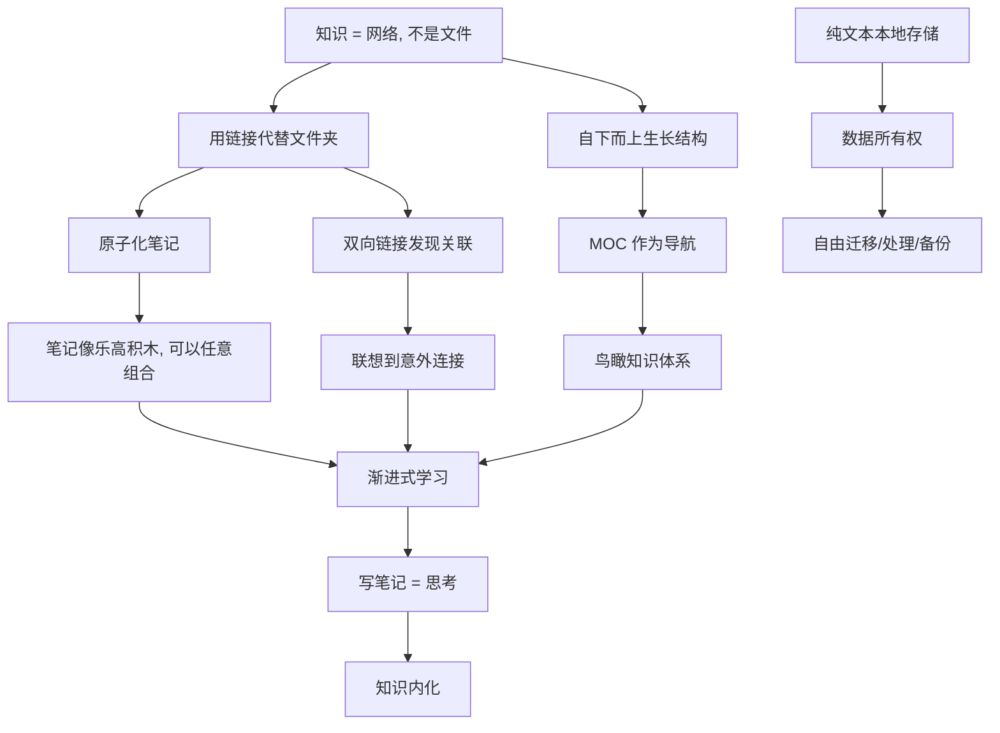

# Obsidian 知识管理的底层逻辑

> 这不是 Obsidian 的操作教程，而是它背后**那套思维方式**——理解了这套逻辑，你才知道 Obsidian 到底应该怎么用，以及为什么它和其他笔记软件不一样。

---

## 0. 一句话总纲

> **Obsidian 的底层逻辑只有一句话：知识不是被存起来的，而是被连接出来的。**

大部分笔记软件的核心假设是「知识 = 文件」，所以帮你把文件**分好类、存整齐**。
Obsidian 的核心假设是「知识 = 网络」，所以它帮你做的是**建立连接、看到关系**。

---

## 1. 最大的范式转换：从「文件夹」到「链接」

### 传统软件的认知模型（文件柜）

```
📁 年度报告/
  ├── 📁 财务/
  │   ├── Q1报告.docx
  │   └── Q2报告.docx
  └── 📁 市场/
      └── 竞品分析.docx
```

**核心假设**：一个文件只有一个位置。
**问题**：一篇笔记可能涉及多个主题——你把它放哪？

### Obsidian 的认知模型（网络）

```
[[竞品分析]] ←——→ [[Q2营收趋势]]
    ↑                    ↑
    |                    |
[[市场策略]] ←——→ [[产品路线图]]
```

**核心假设**：一篇笔记可以出现在无数个上下文中。
**解决方案**：不纠结「放哪」，而是问「跟谁连」。

> 这就是 Obsidian 和 Notion/飞书/印象笔记**最根本的区别**——不是一个功能差异，而是对「知识是什么」这个问题的不同回答。

---

## 2. 第二个底层原则：笔记原子化

### 原则

> **一篇笔记只讲一个概念。**

```
❌ 坏习惯：
一篇笔记叫《Python笔记》，里面从变量写到神经网络

✅ 好习惯：
变量与数据类型.md          ← 一个概念
控制流-for循环.md          ← 一个概念  
函数定义与参数.md          ← 一个概念
NumPy数组基础操作.md       ← 一个概念
```

### 为什么？

| 维度 | 大而全的笔记 | 原子化笔记 |
|------|------------|-----------|
| 链接复用 | ❌ 不能精确链接到某一段 | ✅ 可以精确指向这个概念 |
| 组合灵活度 | ❌ 只能以整篇为单位 | ✅ 可以像积木一样拼装 |
| 复习效率 | ❌ 每次都看一大堆 | ✅ 聚焦一个点，消化快 |
| 发现关联 | ❌ 知识是封闭的 | ✅ 更容易发现概念间的连接 |

**原子化 + 链接 = 知识积木系统。**

原子化的笔记就像乐高积木块，每块很小，但你可以用它们拼出任何形状。而大而全的笔记就像一块已经拼好的乐高模型——看起来完整，但没法重新组合。

---

## 3. 第三个底层原则：自下而上的结构生长

### 自顶向下（传统方式）vs 自下而上（Obsidian 方式）

```
自顶向下（传统笔记软件强迫你这么做）：
  先建好文件夹体系 → 再把笔记放进去 → 放不进去就硬塞

  比如你刚学 Python，就要先决定：
  我是建「编程语言」文件夹
  还是「AI学习」文件夹？
  万一以后转了 JavaScript，这个结构还对吗？

自下而上（Obsidian 的方式）：
  先随便写 → 笔记多了自然聚成簇 → 簇大了再加结构

  先写 5 篇 Python 笔记
  写 3 篇 PyTorch 笔记  
  突然发现：它们都是「AI学习」的一部分 → 建一个 MOC 收起来
```

### 为什么自下而上更好？

**因为你还没学完的时候，不可能知道最终的结构应该是什么样的。**

```
你开始学「机器学习」时：
  - 不知道「监督学习」和「无监督学习」是两大分支（刚学完才知道）
  - 不知道「迁移学习」会变成一个重要专题（踩坑后才懂）
  - 不知道你会用 PyTorch 而不是 TensorFlow（用了才知道）

自顶向下强制你预先猜一个结构 → 必然猜错 → 后面要重构
自下而上让结构从笔记中自然长出来 → 结构与知识同步成熟
```

---

## 4. 第四个底层原则：双向链接改变信息的发现方式

### 单向链接（传统笔记软件）

```
你翻到笔记 A → 底部有链接指向笔记 B → 只看得到 A→B 这一条线
```

### 双向链接（Obsidian）

```
你在看笔记 A
  → 底部「反向链接」面板显示：笔记 C、笔记 D、笔记 E 都引用了 A
  → 你突然发现：原来 A 这个概念跟之前完全没想到的 D 也有关系
  → 灵感来了
```

### 为什么双向链接是革命性的？

**因为人类大脑就是这样工作的。**

你想到一个概念时，不是顺着一个树状结构往下找，而是：

```
「注意力机制」→ 你脑中跳出...
    ├── Transformer 架构
    ├── 机器翻译应用场景
    ├── 我最近在看的论文
    └── 欸？它跟 RAG 也有关系...
```

这就是**联想式思考**。Obsidian 的双向链接就是在模拟这个过程。
而文件夹结构模拟的是**图书馆编目员**的思维——这两个思维方式完全不同。

---

## 5. 第五个底层原则：写笔记就是思考

### 大多数人的误区

```
阅读 → 划线/高亮 → 保存 → 再也不看了
```

这是一种**被动收集**——你觉得在「积累知识」，其实只是在搬运文字。

### Obsidian 倡导的方式

```
阅读 → 理解 → 用自己的话重写 → 建立链接 → 纳入知识网络
```

**判断标准：你是不是用自己的话重新写了一篇？**

如果是直接复制粘贴，那不是笔记，是**剪报**。
如果是看了以后，关掉原文，用你自己的语言解释了一遍，并且跟已有笔记建立了链接——那才是真正的笔记。

> **写作即思考。** 你不需要「先想清楚再写」——你是通过写来想清楚的。

---

## 6. 第六个底层原则：渐进式学习

知识不是一次到位的，而是逐步加深的。

```
第1层：捕获（Capture）
  快速记下想法，不追求完美

第2层：整理（Organize）  
  建立链接，放到 MOC 中

第3层：提炼（Distill）
  标识重点，写下自己的理解

第4层：表达（Express）
  输出成文章、项目、报告

第5层：连接（Connect）
  在更高层次上打通不同领域
```

**Obsidian 的灵活性在于：同一篇笔记可以在不同阶段做不同的事。**

```
一篇新笔记：
  - 今天：随便写几个要点 → 捕获状态
  - 一周后：加了个 MOC 链接 → 整理状态  
  - 一个月后：写了段自己的理解 → 提炼状态
  - 半年后：用来写了一篇文章 → 表达状态
```

没有强制流程，没有固定模板——怎么用取决于你当前的需要。

---

## 7. 第七个底层原则：你的数据你做主

### 本地优先 + 纯文本

```markdown
# 这篇笔记就是一个普通文本文件
- 没有专有格式
- 没有数据库依赖
- 没有云服务绑定
- 任何文本编辑器都能打开
```

### 这意味着什么？

| 场景 | 其他笔记软件 | Obsidian |
|------|-------------|---------|
| 软件停止开发 | 笔记锁死在里面 | **文件还在，用别的工具继续编辑** |
| 想批量操作 | 只能通过官方 API | `grep`、`sed`、Python 脚本随便处理 |
| 换工具 | 导出格式经常乱 | **本来就是标准 Markdown，直接迁移** |
| 版本管理 | 没有或有限 | `git init` 就搞定了 |
| 离线使用 | 功能受限 | **完全一样，纯本地文件** |

**这不是技术选择，而是一种对数据所有权的态度。**

---

## 8. 所有原则的关系图谱



---

## 9. 这些原则实际意味着什么——操作建议

| 原则 | 操作上怎么做 |
|------|------------|
| **链接 > 文件夹** | 写 `[[]]` 比建文件夹更重要。犹豫放哪？先写链接。 |
| **原子化笔记** | 一篇笔记只讲一个概念。超过一屏就考虑拆分。 |
| **自下而上** | 不用提前设计结构。写到 10 篇相关笔记时，再建 MOC。 |
| **双向链接** | 每篇笔记底部留一块「相关笔记」区。 |
| **写就是思考** | 不要复制粘贴。关掉原文用自己的话写。 |
| **渐进式** | 允许笔记是「未完成」的。先记下来，以后慢慢完善。 |
| **数据主权** | 定期 git 备份。不依赖任何云服务作为唯一存储。 |

---

## 10. 和其他软件的本质差异

| 维度 | Obsidian | Notion / 飞书 | 印象笔记 / 有道 |
|------|----------|--------------|----------------|
| **对知识的理解** | 知识 = 网络 | 知识 = 数据库 | 知识 = 文件 |
| **核心操作** | `[[]]` 建立链接 | 拖拽建表、关联数据库 | 建笔记本、打标签 |
| **结构来源** | 自下而上生长 | 自顶向下设计 | 自顶向下设计 |
| **知识发现** | 图谱 + 反向链接 | 数据库筛选 | 搜索 |
| **数据归属** | 本地纯文本 | 云端数据库 | 云端专有格式 |
| **思考深度** | 需要主动写和组织 | 偏收集和整理 | 偏收集 |

**选哪个不取决于功能多少，而取决于你认同哪种「知识观」。**

---

## 🎯 总结：底层逻辑 = 一套认知假设

```
你认为知识是：
  文件 → 用 笔记软件      ← 印象笔记、有道云
  数据库 → 用 Notion      ← Notion、飞书、AirTable
  网络 → 用 Obsidian      ← Obsidian、Roam Research、Logseq
```

Obsidian 的底层逻辑不是一套功能列表，而是一套关于「知识是什么、知识怎么生长」的假设。当你认同这些假设时，Obsidian 用起来得心应手；当你不认同时，它就显得奇怪甚至难用。

所以理解这 7 条底层逻辑，比学会任何一个具体操作都重要——因为它们回答的是 **「为什么这样做」**，而不是 **「怎么做」**。

---

## 🔗 关联笔记

- [[MOC-内容地图完全指南]] — MOC 是这套逻辑的具体实践
- [[Obsidian限定文件夹知识图谱指南]] — 图谱是可视化结果
- [[AI使用者Python基础调研报告]] — 用这套逻辑组织学习

---

*最后更新：2026-07-12*
