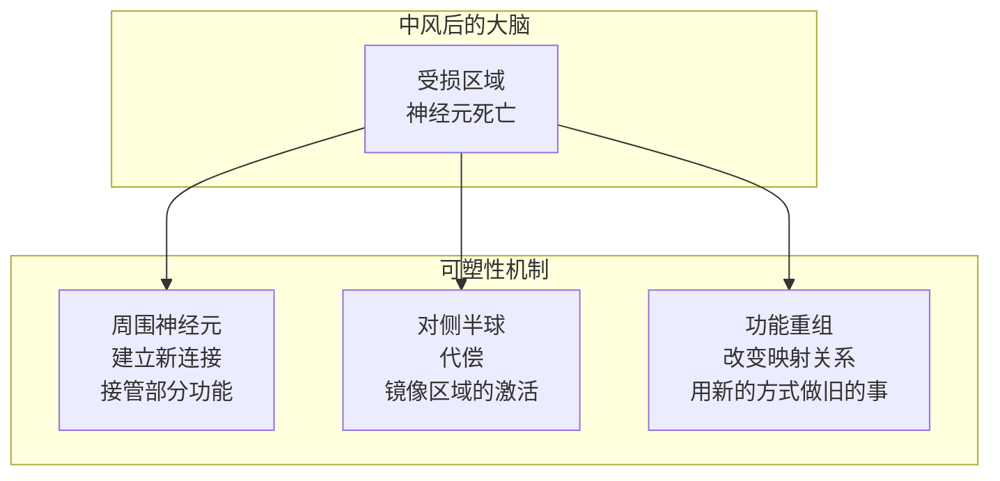

# 中风与神经可塑性

> 中风是大脑的「局部断电」——但大脑并不会就此「死机」。神经可塑性让大脑在损伤后**重新布线**，这也是我们关于学习与记忆的核心启示。

---

## 中风是什么

### 基本概念

```
中风 = 脑部供血中断 → 神经元因缺氧死亡

两种类型：
  - 缺血性中风（占 85%）：血管堵塞，某脑区供血中断
  - 出血性中风（占 15%）：血管破裂，血液压迫脑组织
    
后果：
  死亡的神经元不会被替换
  但周围存活的大脑会尝试「代偿」——这就是神经可塑性的基础
```

### 常见后遗症（取决于损伤位置）

| 损伤位置 | 典型后遗症 |
|:--------:|-----------|
| 左侧运动皮层 | 右侧肢体瘫痪/无力 |
| 布罗卡区 | 失语症（能理解但说不出） |
| 右侧顶叶 | 左侧空间忽略（不注意到左边的世界） |
| 枕叶 | 偏盲 |
| 小脑 | 共济失调（走路不稳） |

---

## 神经可塑性：大脑的自我修复

### 可塑性的三种机制



### 机制 1：周围代偿（Perilesional Reorganization）

```
受损区域周围的神经元长出新的突触连接，
尝试「接管」死亡区域的部分功能。

条件：
  - 损伤不能太大（如果整个功能区都毁了，周围没东西可代偿）
  - 需要训练刺激（不用的代偿不会发生）
  - 有时间窗限制（黄金恢复期一般在 3-6 个月内）
```

### 机制 2：对侧半球代偿

```
左侧运动皮层受损 → 右侧运动皮层（正常情况下不负责左手）
尝试协助左手的运动控制。

代价：
  过度依赖对侧代偿 → 可能阻碍患侧的真正恢复
  所以康复训练的策略是：
    先抑制对侧 → 强迫患侧工作 → 刺激周围代偿
```

### 机制 3：功能重组

```
用不同的神经通路完成相同的任务：
  - 用视觉反馈代替本体感觉来感知肢体位置
  - 用「有意识」的步态控制代替「自动化」的步态
```

---

## 限制可塑性的因素

| 因素 | 机制 | 可干预性 |
|:----:|:----:|:--------:|
| **年龄** | 年轻大脑可塑性更强（BDNF 水平更高、抑制性回路更少） | 不可改变 |
| **损伤范围** | 大面积损伤难以代偿 | 不可改变 |
| **康复启动时间** | 越早开始康复，效果越好 | **可干预** |
| **康复强度** | 重复、密集、任务导向的训练是关键 | **可干预** |
| **睡眠质量** | 睡眠是记忆巩固 + 可塑性发生的时间窗口 | **可干预** |
| **抑郁/动机** | 抑郁阻碍康复（BDNF 降低 + 训练动机下降） | **可干预** |

---

## 对学习和知识管理的启发

### 中风康复 = 极限条件下的学习

```yaml
中风后重新学走路 = 比第一次学走路更难
  - 因为大脑不只是「建立新连接」
  - 还要「抑制旧的不正确的连接模式」
  
你的日常学习 = 正常条件下建立新连接
  - 没有损伤要克服
  - 只需要反复激活 + 加链接

关键共同点——反复激活是关键：
  中风康复：每天重复几百次手部动作 → 重塑运动回路
  你的学习：每天回顾和连接笔记 → 巩固知识网络
```

### 从神经可塑性中学习的三条原则

```
① 用进废退
   不用的连接会减弱（突触修剪）
   你的 Obsidian 孤岛笔记 = 被修剪的突触

② 重复是关键
   单次强烈刺激不如多次温和重复
   每天 5 分钟回顾 > 每周一次 2 小时整理

③ 挑战难度要适中
   太难 → 挫败 → 放弃（HPA 轴激活，抑制可塑性）
   太易 → 无聊 → 无进步
   最优挑战 = 刚好超出当前能力的 10-15%（「最佳学习区」）
```

---

## 关联笔记

- [[海马体与记忆形成机制]] — 神经可塑性与记忆巩固共享相同的突触机制
- [[类脑工作流：像大脑一样工作]] — 可塑性原则在工作流设计中的体现
- [[前额叶皮层与执行功能]] — 前额叶在康复中的「大脑CEO」角色
- [[脑神经科学入门：从神经元到认知]] — 神经可塑性的细胞基础（LTP/LTD）
- [[抑郁症的神经基础]] — 抑郁与中风康复的相互影响

## 待完善

%% 可以补充：约束诱导运动疗法（CIMT）的原理和疗效、镜像疗法的神经机制、语言康复中的特定策略（旋律语调疗法 MIT）、运动技能学习的神经可塑性（与中风康复一致）、BDNF 基因多态性与康复效果差异、脑机接口在中风康复中的应用 %%
