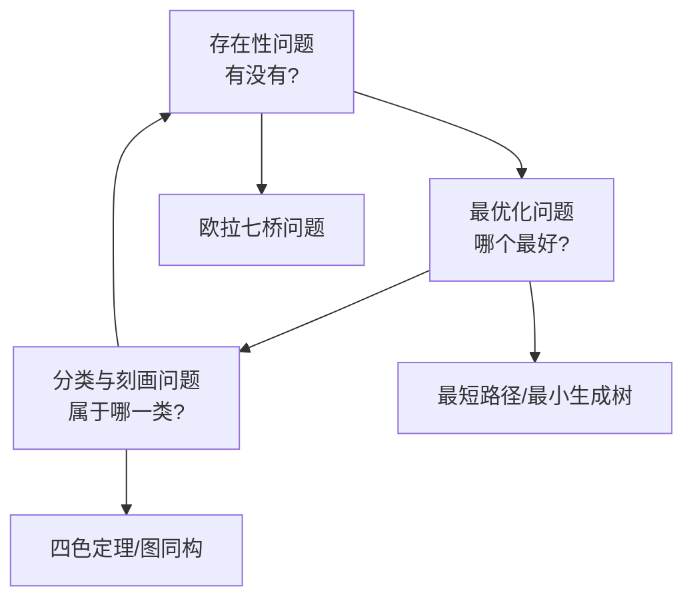

# 图论的基本问题、方法与研究理论

> 如果说 [[图论入门：从Obsidian到AI]] 是图论的「直觉入门」，
> 这篇是图论的「系统框架」——基本问题、通用方法、理论版图。

---

## 一、图论研究的基本问题

图论看似庞杂，但所有研究问题可以归结为 **三大类基本问题**。

### 问题 1：存在性问题

> **某个结构的图是否存在？**

```
经典问题：
  - 是否存在一个每个顶点的度都是 3 的 6 顶点图？
  - 是否存在一个包含所有可能边的 5 顶点图？
  - 给定一个图，是否存在一条经过所有边恰好一次的路径？
    （欧拉路径问题——图论的起源）

在 AI 中的体现：
  - 是否存在一个满足特定约束的神经网络结构？
  - 一个知识图谱中，两个实体之间是否存在某种关系路径？
```

### 问题 2：最优化问题

> **在满足约束的条件下，找到图上的最佳方案。**

```
经典问题：
  - 最短路径：从 A 到 B 怎么走最近？（Dijkstra 算法）
  - 最小生成树：如何用最短的网线连接所有电脑？
  - 最大流：一个管道网络最多能输送多少流量？
  - 旅行商问题（TSP）：最短路线走完所有城市再回来

在 AI 中的体现：
  - 在 Transformer 中，token 之间的注意力权重分布（优化信息传递路径）
  - 推荐系统中，找到用户最可能感兴趣的物品路径
  - 计算图中，优化计算路径以减少内存和计算量
```

### 问题 3：分类与特征刻画问题

> **如何描述和区分不同的图？图具有什么性质？**

```
经典问题：
  - 两个图是不是「相同」的？（图同构问题）
  - 一个图能用多少种颜色给顶点染色，使得相邻顶点不同色？
    （着色问题——四色定理）
  - 一个图是平面的吗？（能否画在平面上边不相交）

在 AI 中的体现：
  - 分子图分类（预测某种分子是否有药性）
  - 图神经网络中，如何用一种表示「捕获」图的结构特征
  - 社交网络中的社区发现（自动识别图中的自然簇）
```

### 三大问题之间的关系



> **图论中任何一个具体问题，都能归到这三类之一。**

---

## 二、图论的基本方法

图论研究者在解决问题时，有 **几套反复出现的通用工具**。

### 方法 1：图表示法

把图画转化成数学可以运算的形式。

#### 方法 1a：邻接矩阵

```python
# 一个 4 个顶点的无向图
#   V = {A, B, C, D}
#   E = {(A,B), (B,C), (C,D), (A,C)}

# 邻接矩阵——行和列都是顶点，格子表示是否相连
    A  B  C  D
A  [0, 1, 1, 0]
B  [1, 0, 1, 0]
C  [1, 1, 0, 1]
D  [0, 0, 1, 0]

# 在 Transformer 中的自注意力矩阵，就是邻接矩阵的带权版本
# 不过权值不是 0/1，而是连续值（注意力分数）
```

**优缺点**：直观、稠密图好用；但稀疏图浪费空间。

#### 方法 1b：邻接表

```python
# 同一个图，用邻接表表示：
A: [B, C]     ← A 连着 B 和 C
B: [A, C]
C: [A, B, D]
D: [C]        ← D 只连着 C

# 在 Obsidian 中的体现——
# 每篇笔记底部的「出链」列表就是邻接表
# 反向链接面板就是入度的邻接表
```

**优缺点**：节省空间、稀疏图高效。

#### 方法 1c：度序列

```
将图中所有顶点的度从大到小排列：
  [3, 2, 2, 1]  ← 上图的度序列
```

> **度序列包含大量图的全局信息**。两个图如果有不同的度序列，它们一定不同构；但同序列不一定同构——这是一个活跃的研究方向。

### 方法 2：图遍历

> **「走一遍」是理解图结构的基本手段。**

#### 深度优先搜索 (DFS)

```python
# 沿着一条路走到黑，走不通再回头
# 就像 Obsidian 中跟着 [[]] 链接一层层点进去
def dfs(graph, start, visited):
    visited.add(start)
    for neighbor in graph[start]:
        if neighbor not in visited:
            dfs(graph, neighbor, visited)
```

**用途**：检测环、拓扑排序、连通分量、迷宫求解。

#### 广度优先搜索 (BFS)

```python
# 一层一层往外扩展
# 就像 Obsidian 的局部图谱，把深度设成 1、2、3...
def bfs(graph, start):
    queue = [start]
    visited = {start}
    while queue:
        node = queue.pop(0)
        for neighbor in graph[node]:
            if neighbor not in visited:
                visited.add(neighbor)
                queue.append(neighbor)
```

**用途**：最短路径（无权图）、社交网络中的「六度分隔」度量。

### 方法 3：图论算法

| 算法 | 解决的问题 | 复杂度 |
|------|-----------|:------:|
| **Dijkstra** | 单源最短路径（带权图） | $O(V^2)$ 或 $O(E + V\log V)$ |
| **Kruskal / Prim** | 最小生成树 | $O(E\log E)$ |
| **Ford-Fulkerson** | 最大流 | $O(E \cdot f)$ |
| **Floyd-Warshall** | 所有顶点对之间的最短路径 | $O(V^3)$ |
| **Tarjan** | 强连通分量、割点、桥 | $O(V+E)$ |
| **Bellman-Ford** | 负权边情况下的最短路径 | $O(VE)$ |

### 方法 4：图的不变量 (Invariants)

> 用一个数值来「概括」图的某个特征。

| 不变量 | 定义 | 含义 |
|-------|------|------|
| **顶点数** $n$ | 图中顶点的数量 | 规模 |
| **边数** $m$ | 图中边的数量 | 密度 |
| **色数** $\chi(G)$ | 给图着色所需的最少颜色数 | 图的「复杂程度」 |
| **团数** $\omega(G)$ | 图中最大完全子图的顶点数 | 内部互联程度 |
| **独立数** $\alpha(G)$ | 图中最大的互不相连的顶点集合 | 稀疏程度 |
| **围长** $g(G)$ | 图中最短环的长度 | 局部结构 |
| **直径** $d(G)$ | 最远两个顶点之间的距离 | 图的「广度」 |

**为什么图不变量重要**？因为两个图如果不同的不变量，它们一定不同构——这是快速判断图是否「一样」的重要工具。

### 方法 5：归纳与构造

```
图论中一种常见的证明/研究方法：

归纳步骤：
  假设结论对 n-1 个顶点的图成立
  给图添加第 n 个顶点
  证明添加后的图仍然满足结论

构造方法：
  为了证明「存在一个具有性质 P 的图」，
  直接把它造出来
```

---

## 三、图论的主要研究理论分支

### 🔴 第一梯队：经典核心领域（基础理论）

#### 1. 极值图论 (Extremal Graph Theory)

```
核心问题：
  一个图在「不包含某种子图」的条件下，最多能有多少条边？

经典结果：
  Turán 定理——如果一个 n 顶点图不含 K_{r+1}（r+1 顶点的完全图），
  则边数不超过 (1 - 1/r) * n²/2

  Mantel 定理——不含三角形的 n 顶点图，最多有 ⌊n²/4⌋ 条边

应用：
  社交网络中，一个群体如果不希望出现「三方闭环」（防止小团体），
  最多能有多少社交关系？
```

#### 2. 代数图论 (Algebraic Graph Theory)

```
用线性代数研究图：
  图的邻接矩阵的特征值 → 揭示图的全局性质
  Laplacian 矩阵 → 图的连通性、谱聚类

核心概念：
  谱 (Spectrum)：邻接矩阵的所有特征值
  Laplacian 矩阵：D - A（度矩阵 - 邻接矩阵）

应用：
  Google 的 PageRank（基于邻接矩阵的主特征向量）
  图神经网络的消息传递本质上是 Laplacian 上的卷积
  谱聚类（将图分割成簇的标准方法之一）
```

#### 3. 随机图论 (Random Graph Theory)

```
如果图中的边是随机生成的，图会有什么性质？

Erdős–Rényi 模型 G(n, p)：
  有 n 个顶点，每条边以概率 p 独立出现

里程碑发现：
  当 p 超过某个阈值时，图会「突然」出现某个性质（相变）
  例如：当 p > ln(n)/n 时，图几乎必然连通

应用：
  复杂网络（互联网、社交网络）的形成机制
  神经网络随机初始化的性质分析
```

#### 4. 拓扑图论 (Topological Graph Theory)

```
研究图的「画法」——图能否画在某个曲面上边不相交？

核心概念：
  平面图 (Planar Graph)：可以画在平面上边不相交
  曲面嵌入：图在球面、环面、莫比乌斯带上的画法
  图子式 (Graph Minor)：删点和缩边得到的子结构

经典结果：
  四色定理——任何平面图可以用 4 种颜色给顶点染色
  Kuratowski 定理——图是平面图 ⟺ 它不含 K₅ 或 K₃₃ 子结构
  Wagner 猜想（已被 Robertson–Seymour 证明）：图子式构成一个良拟序

应用：
  VLSI 电路布线设计
  印刷电路板（PCB）的线路规划
  地图着色
```

### 🟡 第二梯队：应用驱动的研究领域

#### 5. 网络科学 (Network Science)

```
将图论应用于真实世界的复杂系统：
  - 社交网络分析：影响力传播、社区发现
  - 生物网络：蛋白质相互作用网络、基因调控网络
  - 互联网、万维网的结构分析

核心发现：
  小世界网络（Watts–Strogatz 模型）：
    高聚类系数 + 短平均路径
    → 现实网络（社交、神经、电力）的共同特征

  无标度网络（Barabási–Albert 模型）：
    度分布遵循幂律——少数节点有极高的度（「枢纽」）
    → 互联网、引文网络、人类语言都符合

与 AI 的交集：
  GNN 的基础假设就是真实图网络往往具有这些结构特征
```

#### 6. 图算法与复杂性 (Graph Algorithms & Complexity)

```
研究的不是图本身，而是「在图上高效计算」的问题。

核心问题：
  P vs NP：图的许多重要问题（如哈密顿路径）是 NP 完全的
  参数化复杂性：对于某些参数小的问题，可有高效算法
  近似算法：对于 NP 难问题，能否得到接近最优的解

经典 NP 完全的图问题：
  - 图着色问题
  - 哈密顿路径/回路
  - 最大团 (Max Clique)
  - 顶点覆盖 (Vertex Cover)
  - 独立集 (Independent Set)

应用：
  几乎所有图论算法的实际应用
  计算化学中的分子结构搜索
```

#### 7. 谱图理论 (Spectral Graph Theory)

```
代数图论 + 应用 = 谱图理论

核心思想：
  图的邻接矩阵和 Laplacian 矩阵的特征值和特征向量，
  编码了图的全局结构信息。

关键结果：
  Cheeger 不等式：谱隙（特征值 gap）与图的分割质量相关
  谱聚类：用 Laplacian 的次小特征向量将图分成簇
  Expander 图：稀疏但高度连通、谱性质优异的图

在 AI 中的直接应用：
  GCN (Graph Convolutional Network)：
    核心操作 = 在图的谱域（特征空间）中做卷积
    本质 = 用 Laplacian 的特征向量作为图信号的傅里叶基

  图神经网络中的消息传递：
    可以看作谱图理论中「图信号处理」的推广
```

#### 8. 图深度学习 (Graph Deep Learning) — 新兴交叉领域

```
图论 + 深度学习，最近 5 年发展最快的方向之一。

模型类型：
  GCN (Graph Convolutional Network)
  GAT (Graph Attention Network)
  GraphSAGE
  GIN (Graph Isomorphism Network)
  MPNN (Message Passing Neural Network)

解决的问题：
  - 图节点分类（社交网络中的用户类型）
  - 图边预测（推荐系统中的链接预测）
  - 图层级分类（分子是否有毒）
  - 图生成（药物分子设计）

与经典图论的关系：
  GIN 的理论基础就是图论中的 WL (Weisfeiler-Lehman) 图同构测试
  消息传递框架 = 图论中的局部邻域聚合
```

---

## 四、图论研究的「三大基本问题 × 主要分支」矩阵

| 研究分支 | 主要问的存在性问题 | 主要问的最优化问题 | 主要问的分类与刻画问题 |
|---------|:-----------------:|:-----------------:|:---------------------:|
| **极值图论** | 不含某子图的最大边数 | —— | 图的结构极端值 |
| **代数图论** | 特征值决定图的存在性 | —— | 用谱分类图 |
| **随机图论** | 性质何时「突然出现」 | —— | 图的典型性质 |
| **拓扑图论** | 图能否嵌入某种曲面 | 最优嵌入方式 | 曲面嵌入的分类 |
| **网络科学** | 真实网络符合哪种模型 | 信息传播最大化 | 社区结构发现 |
| **图算法** | —— | 最短/最大/最优 | 图是否同构 |
| **谱图理论** | —— | 图分割的最优方式 | 用谱特征分类图 |
| **图深度学习** | 图神经网络能否逼近 | 图上的学习任务 | 图的表示学习 |

---

## 五、图论研究的一般工作流

当一个图论研究者面对一个新问题时，通常的思考路径：

```
第 1 步：问题建模
  └─ 这是一个存在性问题、最优化问题还是分类问题？
  
第 2 步：图表示
  └─ 用邻接矩阵、邻接表、度序列还是 Laplacian 矩阵？
  
第 3 步：不变量检查
  └─ 计算已知不变量，寻找规律或反例
  
第 4 步：寻找已知结论
  └─ 这个问题是已知定理的推论吗？
  └─ 它跟经典问题（着色、匹配、流）有关吗？
  
第 5 步：构造或证明
  └─ 构造性证明 / 归纳法 / 概率法 / 代数法
  └─ 或者设计算法求解
  
第 6 步：复杂度分析
  └─ 问题是 P 还是 NP？
  └─ 如果 NP 难，可以近似吗？
```

---

## 六、总结

### 基本问题（研究什么）

```
① 存在性：某个结构存不存在？
② 最优化：在多种方案中哪个最好？
③ 分类：这个图属于哪一类、具有什么性质？
```

### 基本方法（用什么研究）

```
① 图的表示：邻接矩阵 / 邻接表 / 度序列
② 图遍历：DFS / BFS
③ 图论算法：Dijkstra / Kruskal / Ford-Fulkerson / Tarjan
④ 图不变量：色数 / 团数 / 直径 / 谱
⑤ 归纳与构造
```

### 主要研究理论（分支版图）

```
经典核心：极值图论 → 代数图论 → 随机图论 → 拓扑图论
应用驱动：网络科学 → 图算法 → 谱图理论
新兴交叉：图深度学习（GNN）
```

---

## 🔗 关联笔记

- [[图论入门：从Obsidian到AI]] ← 直观入门
- [[Obsidian完美使用工作流]] ← 图论在笔记中的体现
- [[Transformer 架构]] ← 自注意力 = 带权完全图
- [[MOC-图论]]（建议创建）

---

*最后更新：2026-07-12*
