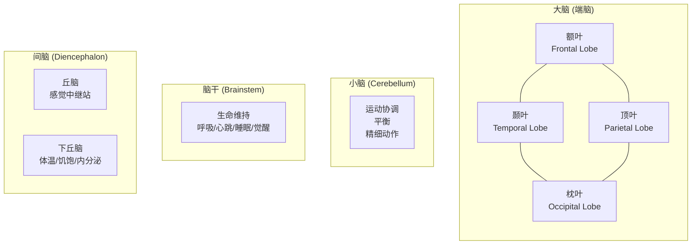

# 大脑脑区与功能全景图

> 人脑约 **860 亿** 个神经元，组织成不同的脑区，每个区域承担相对特化的功能。这是它们的完整地图。

---

## 0. 宏观层次：大脑的四大分区



---

## 第一章：大脑皮层四个脑叶（核心）

大脑皮层是覆盖在大脑表面的灰色褶皱，约 **2-4mm 厚**，但展开约有 **2,500 cm²**（一张报纸大小）。分为四个脑叶。

### 1.1 额叶 (Frontal Lobe)

**位置**：额头后方，大脑最前面的部分，最大的脑叶。

| 子区域 | 功能 | 损伤后果 |
|--------|------|---------|
| **前额叶皮层 (PFC)** | 决策、规划、目标设定、抑制控制、工作记忆、人格 | 冲动、决策力下降、人格改变 |
| **运动皮层 (Motor Cortex)** | 自主运动的执行 | 对侧肢体瘫痪 |
| **布罗卡区 (Broca's Area)** | 语言产生（左侧额叶） | 能理解但不能说话（布罗卡失语症） |
| **额叶眼动区 (FEF)** | 控制眼球运动 | 视觉追踪障碍 |
| **辅助运动区 (SMA)** | 运动序列的规划 | 自发运动减少 |

**与前面对话的关联**：
- 这就是「类脑工作流」中 **前额叶皮层 = 集中模式、深度工作** 的神经基础
- 「前额叶在早上能量最高」→ 最难的事最早做
- 这也是为什么**多任务并行会耗尽前额叶资源**→ 你会做出糟糕决策

**典型案例 - 盖奇 (Phineas Gage)**：
```
1848 年，一根铁棍穿过他的前额叶。
结果：他的智力、记忆、运动都正常。
但他的**人格**彻底改变了——
以前是负责可靠的人，变得冲动、粗鲁、无法规划未来。
→ 证明了前额叶不是负责「思考」的，
  而是负责「做出好的决策和控制冲动」的。
```

---

### 1.2 顶叶 (Parietal Lobe)

**位置**：头顶区域，额叶后方。

| 子区域 | 功能 | 损伤后果 |
|--------|------|---------|
| **躯体感觉皮层 (S1)** | 触觉、痛觉、温度觉、本体感觉（知道身体的位置） | 触觉缺失或感觉异常 |
| **顶上小叶** | 空间感知、注意力导向 | 空间忽略症 |
| **顶下小叶** | 数学计算、复杂信息整合 | 计算障碍 |
| **角回 & 缘上回** | 阅读、理解隐喻、左右区分 | 失读症、手指失认 |

**典型案例 - 空间忽略症**：
```
右侧顶叶受损的患者：
  - 只画钟表的右半边
  - 只吃盘子右侧的食物
  - 只跟站在右侧的人说话
  这不是「看不见」——他们的眼睛没问题。
  是大脑**不注意**左侧的空间了。
```

---

### 1.3 颞叶 (Temporal Lobe)

**位置**：耳朵上方及后方，大脑两侧。

| 子区域 | 功能 | 损伤后果 |
|--------|------|---------|
| **初级听觉皮层 (A1)** | 处理声音信号 | 听力障碍 |
| **韦尼克区 (Wernicke's Area)** | 语言理解（左侧颞叶） | 说话流利但**没有意义**（韦尼克失语症） |
| **海马体 (Hippocampus)** | **记忆形成**——短期→长期 | 无法形成新记忆（H.M. 病人） |
| **杏仁核 (Amygdala)** | 情绪（尤其是恐惧、愤怒） | 情绪处理异常 |
| **梭状回 (Fusiform Gyrus)** | 面部识别 | 面孔失认症（看不清人脸） |
| **下颞叶皮层 (IT)** | 物体识别 | 物体失认症 |

**与前面对话的核心关联**：

> **海马体** —— 你之前了解到的阿尔兹海默症**最先受损的脑区**
> - 这就是为什么 AD 的第一症状是**忘记最近发生的事**
> - 这也是为什么你的 Obsidian 可以看作「外部海马体」

> **韦尼克区 vs 布罗卡区** —— 理解与表达的分工
> ```
> 布罗卡区（额叶）= 语言输出（写/说）
> 韦尼克区（颞叶）= 语言输入（读/听）
> 连接它们的弓状束 = 让你能重复听到的话
> ```

---

### 1.4 枕叶 (Occipital Lobe)

**位置**：后脑勺，大脑最后面。

| 子区域 | 功能 |
|--------|------|
| **初级视觉皮层 (V1)** | 接收来自眼睛的信号 |
| **次级视觉区 (V2-V5)** | 处理颜色（V4）、运动（V5/MT）、深度、形状 |

**与前面对话的关联**：

> 这就是上一份笔记 [[机器学习与脑神经科学的关系]] 中提到的：
> - **Hubel & Wiesel 发现的视觉皮层层级结构**（简单细胞→复杂细胞）
> - 直接启发了 CNN 的架构设计
> - 训练 CNN 做图像分类 → 它内部学到了与 V1-V4 相似的特征

```yaml
枕叶的层级处理：
V1：检测边缘和朝向（简单细胞）
  ↓
V2：检测轮廓和纹理（复杂细胞）
  ↓
V4：检测颜色和形状
  ↓
IT（颞叶）：检测完整物体（如面孔、手）
```

---

## 第二章：皮层下结构（隐藏的关键区域）

### 2.1 丘脑 (Thalamus) — 感觉的中继站

```
所有的感觉信息（除了嗅觉）：
  眼睛 → 丘脑 → 枕叶（视觉）
  耳朵 → 丘脑 → 颞叶（听觉）
  皮肤 → 丘脑 → 顶叶（触觉）

丘脑就是大脑的「信号收发室」——
几乎所有的输入都要经过它才能到达皮层。
```

### 2.2 下丘脑 (Hypothalamus) — 身体的自动调节器

```
大小只有一颗豌豆，但控制：
  - 体温（让你出汗/发抖）
  - 饥饿与饱腹（食欲）
  - 口渴
  - 睡眠节律（昼夜节律）
  - 内分泌系统（通过垂体）
  - 性行为

它不负责「思考」，负责让你的身体保持平衡（稳态）。
```

### 2.3 基底核 (Basal Ganglia) — 运动与习惯的中心

```
功能：
  - 运动的选择和启动
  - 习惯的形成和自动化
  - 动作序列的学习

相关疾病：
  - 帕金森病（基底核多巴胺不足）→ 运动困难、僵硬
  - 亨廷顿病（基底核神经元死亡）→ 不自主舞蹈状运动

与工作流的关联：
  当你把一个动作变成「习惯」时，
  控制权从前额叶（费脑）转移到了基底核（不费脑）。
  这就是习惯如此强大的神经基础。
```

### 2.4 小脑 (Cerebellum) — 运动协调大师

```
虽然只占脑体积的 10%，但拥有超过一半的神经元。
功能：
  - 精细运动的协调
  - 平衡
  - 运动学习（学会骑自行车后就靠小脑）

新发现（近20年）：
  小脑也参与认知协调——注意力切换和语言流畅性
```

### 2.5 扣带回 & 岛叶

| 区域 | 功能 |
|------|------|
| **前扣带回 (ACC)** | 错误检测、冲突监控、注意力分配 |
| **岛叶 (Insula)** | 身体感觉（心跳、呼吸）、共情、厌恶 |

---

## 第三章：全脑的功能网络（现代神经科学的视角）

现代神经科学不只看「某脑区做什么」，而是看**不同脑区如何协同**形成网络。

### 3.1 默认模式网络 (Default Mode Network, DMN)

```
核心节点：内侧前额叶、后扣带回、角回

活跃时机：当你「什么都不做」的时候
  - 做白日梦时
  - 回忆过去时
  - 想象未来时
  - 走神时

功能：自我反思、社会认知、创造力、记忆整合

与我们之前对话的关联：
  DMN = 发散模式的大脑基础
  散步时「灵光一现」→ 就是 DMN 在工作
```

### 3.2 突显网络 (Salience Network, SN)

```
核心节点：前扣带回 (ACC)、前岛叶

功能：检测「什么东西值得注意」
  - 自动评估外部事件的重要性
  - 在 DMN（内部思考）和 CEN（外部任务）之间切换
  - 觉得「这件事很重要」→ 启动集中模式

异常：自闭症谱系中 SN 功能异常 → 
  无法判断「什么信息值得关注」
```

### 3.3 中央执行网络 (Central Executive Network, CEN)

```
核心节点：背外侧前额叶、后顶叶

功能：需要专注时的「大脑指挥官」
  - 工作记忆
  - 任务切换
  - 目标导向行为
  - 抑制干扰

与我们之前对话的关联：
  CEN = 集中模式的大脑基础
  深度工作时活跃的就是这个网络
```

### 三个网络的切换（你每天都在用）

```yaml
休息/走神:         DMN 活跃（内部漫游）
                                                   ── DMN 和 CEN 是「跷跷板」关系
                                           ——此消彼长
突然有重要任务:     SN 检测到 → 切换
                                                   ── SN 是开关
集中工作:           CEN 活跃（外部专注）

我们之前说的：
  「集中 90 分钟 → 休息 20 分钟」
  = CEN 运行 90 分钟 → 切换到 DMN 20 分钟
```

---

## 第四章：脑区功能总结表

### 4.1 按功能分类

| 功能 | 主要脑区 | 备注 |
|:----:|---------|------|
| **决策与规划** | 前额叶皮层（额叶） | 工作流的「优先级判断」 |
| **注意力** | 前额叶 + 顶叶 | 集中（CEN）/ 发散（DMN）切换 |
| **语言表达** | 布罗卡区（额叶） | 说和写 |
| **语言理解** | 韦尼克区（颞叶） | 听和读 |
| **记忆形成** | 海马体（颞叶） | AD 最早受损的区域 |
| **情绪** | 杏仁核 + 前额叶 | 恐惧、愤怒、情绪调节 |
| **视觉** | 枕叶（V1-V5）→ 下颞叶 | 层次化处理 → 启发了 CNN |
| **听觉** | 颞叶 (A1) | 声音处理 |
| **触觉** | 顶叶 (S1) | 身体感觉 |
| **运动** | 运动皮层 + 小脑 + 基底核 | 执行 + 协调 + 习惯 |
| **空间感知** | 顶叶 | 东西在哪里？ |
| **人脸识别** | 梭状回（颞叶） | 专门化区域 |
| **错误检测** | 前扣带回 | 「我感觉不对」的神经信号 |
| **意识** | 全脑网络 | 不是单个区域 |

### 4.2 按脑区排列

| 脑区 | 核心功能 | 一句话记法 |
|------|---------|-----------|
| **前额叶皮层** | 决策、规划、自控、工作记忆 | **CEO** — 大脑的总经理 |
| **运动皮层** | 动作执行 | 喇叭口形状，精细部位占用更多空间 |
| **躯体感觉皮层** | 身体感觉 | 与运动皮层相邻，有「小人图」对应 |
| **布罗卡区** | 语言产生 | 能理解但说不了 |
| **韦尼克区** | 语言理解 | 能说但说了没意义 |
| **海马体** | 记忆形成 | 刚发生的事 → 存到长期 |
| **杏仁核** | 情绪（尤其恐惧） | 「战斗或逃跑」的启动器 |
| **丘脑** | 感觉中继站 | 所有信息先到这里 |
| **下丘脑** | 身体自动调节 | 体温、饥饿、睡眠 |
| **基底核** | 运动选择 + 习惯 | 前额叶费脑→变成了习惯→交给基底核 |
| **小脑** | 运动协调 | 占 10% 体积但有一半的神经元 |
| **前扣带回** | 错误检测、冲突 | 「哪里不对」的感觉 |
| **梭状回** | 面部识别 | 看不清人脸→梭状回受损 |
| **枕叶 V1** | 视觉起点 | 眼睛的信号第一站 |
| **角回** | 阅读、数学 | 连接视觉和语言 |

---

## 第五章：把这些记忆方法本身用在这里

> **如何记住这些脑区和功能？——用你自己已经掌握的知识网络。**

### 在 Obsidian 中建立「脑区」的网络

```markdown
# 海马体

负责记忆形成。
- 关联：[[阿尔兹海默症]] — 最早受损的脑区
- 关联：[[工作流设计]] — 每日回顾 = 模拟海马体巩固
- 关联：[[机器学习]] — 海马体启发了记忆网络模型
- 上级：[[颞叶]]

# 前额叶皮层

负责决策、规划、注意力。
- 关联：[[类脑工作流]] — 深度工作 = 前额叶活跃
- 关联：[[CNN vs 大脑]] — 不是视觉区域，而是执行控制
- 关联：[[Phineas Gage案例]]
- 上级：[[额叶]]
```

**这样，每当你写一篇新笔记，都可能触发对相关脑区的回忆和链接。**

### 用 MOC 组织「脑区知识」

```markdown
# 🗺️ MOC-脑功能解剖

## 额叶 - 执行与控制
- [[前额叶皮层]] — CEO
- [[布罗卡区]] — 语言输出
- [[运动皮层]] — 运动执行

## 颞叶 - 记忆与语言
- [[海马体]] — 记忆形成
- [[韦尼克区]] — 语言理解
- [[杏仁核]] — 情绪
- [[梭状回]] — 人脸识别

## 顶叶 - 感觉与空间
- [[躯体感觉皮层]] — 触觉
- [[角回]] — 阅读
- [[顶上小叶]] — 空间感知

## 枕叶 - 视觉
- [[V1-V5]] — 视觉层级处理
```

---

## 第六章：这些脑区跟你之前笔记的对应

| 之前聊过的内容 | 涉及的脑区 | 链接 |
|---------------|-----------|------|
| 阿尔兹海默症 | 海马体（最早受损）、内嗅皮层、颞叶 | [[阿尔兹海默症发病率与受教育程度的关系]] |
| 认知储备 | 全脑——前额叶 + 海马体 + 突触密度 | 同上 |
| CNN 启发 | 枕叶 V1-V4 → 下颞叶 IT | [[机器学习与脑神经科学的关系]] |
| 强化学习 | 多巴胺系统 > 基底核 > 前额叶 | 同上 |
| 注意力机制 | 前额叶 + 顶叶（注意力网络） | 同上 |
| 类脑工作流 | 前额叶（集中）、默认模式网络（发散） | [[类脑工作流：像大脑一样工作]] |
| 睡眠 | 下丘脑（昼夜节律）、海马体（巩固） | 同上 |
| Hebbian 学习 | 突触可塑性（全脑） | 同上 |

---

## 🔗 关联笔记

- [[脑神经科学入门：从神经元到认知]] ← 神经科学基础
- [[机器学习与脑神经科学的关系]] ← 脑区与 AI 的对应
- [[类脑工作流：像大脑一样工作]] ← 前额叶 + DMN 的工作流设计
- [[阿尔兹海默症发病率与受教育程度的关系]] ← 海马体与记忆
- [[MOC-脑功能解剖]]（建议创建）

---

## 📚 参考资源

- 交互式脑图：https://www.brainfacts.org/3d-brain （旋转查看各脑区）
- 书籍：《Principles of Neural Science》（Kandel） — 神经科学圣经
- 书籍：《大脑的故事》（David Eagleman） — 适合入门的科普

---

*最后更新：2026-07-12*
