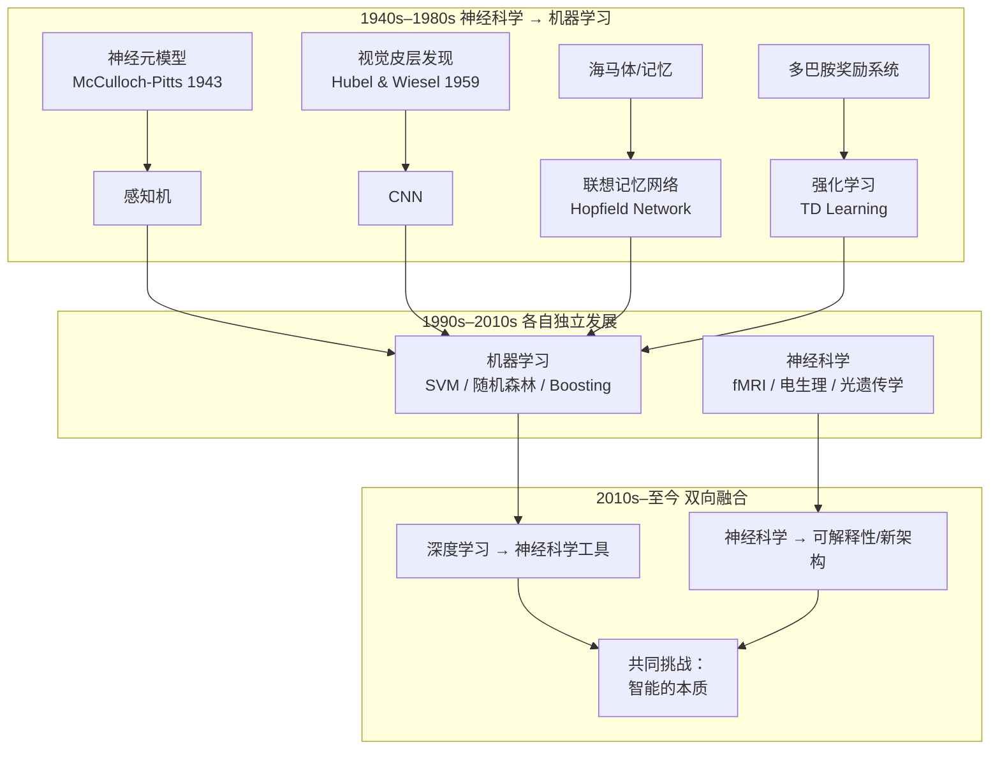

# 机器学习与脑神经科学的关系

> 这两个领域的关系不是单向的「A 启发 B」——而是一场持续 80 年的**双向对话**。

---

## 0. 总览：一张图看清关系



---

## 第一章：神经科学给机器学习的三大奠基性贡献

### 1.1 神经元模型 → 人工神经网络（1943–1958）

这是**一切的开端**。

```
1943 年，神经科学家 McCulloch 和数学家 Pitts 发表论文：
  《A Logical Calculus of Ideas Immanent in Nervous Activity》

他们提出的 McCulloch-Pitts 神经元模型：
  - 接收多个输入信号
  - 如果输入之和超过阈值 → 输出 1
  - 否则 → 输出 0

这个模型直接启发了 1958 年 Rosenblatt 的感知机 (Perceptron)——
而感知机就是今天所有神经网络的老祖宗。
```

**关键事实**：第一个「人工神经网络」不是计算机科学家发明的，而是神经科学家和数学家合作的结果。

### 1.2 视觉皮层发现 → 卷积神经网络（1959–1980s）

> 这是 ML 历史上**最著名的一次「受大脑启发」的成功案例**。

```
1959 年，Hubel 和 Wiesel（后获诺贝尔奖）做了一系列实验：
  把电极插入猫的视觉皮层
  给猫看不同方向的线条
  发现某些神经元只对「特定方向」的线条反应
  有些神经元对「更复杂的模式」反应

→ 他们提出了视觉皮层的层级结构：
  简单细胞（检测边缘方向）
        ↓
  复杂细胞（检测运动方向）
        ↓
  超复杂细胞（检测更复杂的模式）

1980 年，福岛邦彦受此启发提出 Neocognitron
  → 再演变为 LeCun 的 CNN (LeNet-5, 1998)
  → 最终成就了今天的几乎所有计算机视觉
```

**对应关系**：

| 大脑视觉皮层 | CNN 中的对应 |
|------------|-------------|
| 简单细胞（检测边缘方向） | 浅层卷积核（检测边缘/纹理） |
| 复杂细胞（对位置不敏感） | 池化层（下采样，平移不变性） |
| 层级递增的复杂度 | 深层网络（从纹理→部件→物体） |
| 感受野逐渐增大 | 深层神经元看到更大的输入区域 |

### 1.3 多巴胺奖励系统 → 强化学习（1980s–1990s）

```
1980–90 年代，神经科学家在研究猴子大脑时发现了多巴胺神经元的活动模式：
  - 当猴子得到意外的奖励时 → 多巴胺神经元强烈放电
  - 当奖励被准确预测时 → 多巴胺神经元不再放电
  - 当奖励低于预期时 → 多巴胺神经元放电受抑制

这 = 奖励预测误差 (Reward Prediction Error)
  = 实际奖励 − 预期奖励

Sutton 和 Barto（1988, 1998）受此启发提出了：
  - 时序差分学习 (TD Learning)
  - 整个强化学习框架
    
2013 年，DeepMind 将深度学习和强化学习结合 → DQN
  → 成就了 AlphaGo、AlphaZero
```

**关键洞察**：**大脑的多巴胺系统已经在运行「强化学习算法」数百万年了。**

---

## 第二章：机器学习给神经科学的回馈

### 2.1 深度学习作为「大脑模拟器」

传统神经科学的研究方式：
```
观察（用 fMRI/电生理）→ 描述现象 → 提出理论解释
```

加入深度学习后的新方式：
```
观察 → 构建深度学习模型来模拟某脑区功能
      → 看模型的行为是否匹配真实大脑
      → 如果匹配 → 模型架构可能就是大脑算法的假设
      → 分析模型内部 → 提出可检验的预测 → 回生物实验验证
```

**具体案例**：

| 脑区/功能 | 深度学习模型 | 学到了什么 |
|-----------|------------|-----------|
| **视觉皮层 V1-V4** | CNN | CNN 的层级特征与视觉皮层神经元的响应高度一致 |
| **听觉皮层** | 音频 CNN | 同样发现了层级特征编码 |
| **海马体（空间导航）** | 网格细胞模型 | DL 模型自发学会了类似网格细胞的编码 |
| **运动控制** | 深度强化学习 | 模型学会的运动策略与动物行为相似 |

#### 最重要的案例：CNN 为何「像」视觉皮层

```
2014 年，DeepMind 的论文发表了一个惊人发现：
  
  训练一个 CNN 做图像分类
  不需要任何生物约束
  只是让它「把图像分类正确」
  
  → CNN 的隐层激活模式
  → 与猴子视觉皮层单个神经元的放电模式
  → 高度相关（R² > 0.5）

这意味着：
  单纯优化分类任务 → 自发学会了类似生物视觉的表示
  说明深度学习至少在视觉上「做对了什么」
```

### 2.2 ML 成为神经科学的研究工具

| 应用 | 说明 |
|------|------|
| **脑成像分析** | 用 CNN 分割 MRI 图像、检测肿瘤、量化脑萎缩 |
| **脑电图（EEG）解码** | 用深度学习从脑电波中解码「人在想什么」 |
| **连通组学** | 用图神经网络分析大脑连接网络 |
| **蛋白质结构预测** | AlphaFold 预测神经相关蛋白的结构 |
| **行为分析** | 用计算机视觉自动分析动物的行为（如 DeepLabCut） |

### 2.3 脑机接口 (BCI)

```
将 ML 用于「解码大脑信号并控制外部设备」：
  - 从运动皮层信号 → 控制机械臂（瘫痪患者打字、喝水）
  - 从视觉皮层信号 → 为盲人重建视觉
  - 从语言区信号 → 为失语者合成语言（2023 年重大突破）

核心技术：深度学习解码神经信号
```

---

## 第三章：当前最活跃的交叉领域（2020s 至今）

### 3.1 神经AI (NeuroAI)

学术界正在形成的共识——两个领域不应该各自为战。

```
John Krakauer (2023) 在 Nature Neuroscience 发文：
  "真正的通用人工智能不可能仅仅通过扩大模型规模实现，
   需要结合神经科学对智能的理解。"
```

**几个活跃方向**：

| 方向 | 核心问题 | 进展 |
|------|---------|------|
| **突触可塑性与学习算法** | 大脑如何在没有反向传播的情况下学习？ | 正在探索「前向传播」和「局部学习」替代方案 |
| **睡眠与记忆巩固** | 大脑如何在睡眠中巩固记忆？ | 启发 ML 中的「回放」(Replay) 训练策略 |
| **注意力机制** | 大脑的注意力能解释 Transformer 吗？ | 转化注意力 (Transformers) 与生物注意力的差异研究 |
| **稀疏计算** | 大脑只用 1% 的神经元同时工作 | 启发 ML 模型的稀疏激活（如 Mixture of Experts） |
| **全局工作空间理论** | 意识的信息整合理论 | 启发全局工作空间在 AI 架构中实现 |

### 3.2 可解释性研究的桥梁

```
当前 AI 最大的问题之一：「深度学习模型为什么做出了这个判断？」
神经科学的帮助：大脑也是一个「黑箱」，但神经科学家有 100 年研究黑箱的经验。

具体方法借鉴：
  - 消融研究（Ablation）：删除模型的某部分看行为变化
    → 类似于研究脑损伤病人的认知变化
  - 激活最大化和特征可视化
    → 类似于用 fMRI 找「什么刺激激活了某脑区」
  - 扰动法：轻微改变输入看输出变化
    → 类似于经颅磁刺激 (TMS) 干扰某脑区观察行为变化
```

### 3.3 一个重要的提醒：不要过度类比

尽管两个领域互相启发，但必须注意区别：

| 看似相同 | 实则不同 | 过度类比的危险 |
|---------|---------|--------------|
| 人工神经元 → 生物神经元 | 人工神经元是极其简化的版本 | 误以为「深度学习已在模拟大脑」 |
| 误差反向传播 → 不存在的生物过程 | 没有证据表明大脑有类似算法 | 以为大脑的学习机制已被破解 |
| 模型参数 → 突触强度 | 突触的化学复杂度远超一个权重 | 低估了生物学习的复杂性 |
| 训练数据 → 感官输入 | 大脑是主动探索世界，不是被动接收 | 忽视了具身认知 |
| 损失函数 → 奖励/惩罚 | 大脑有数十个相互作用的神经调节系统 | 简化了动机系统的复杂度 |

---

## 第四章：一个贯穿性的对比框架

### 4.1 学习范式对比

| 维度 | 机器学习 | 生物大脑 |
|------|---------|---------|
| **数据需求** | 需要海量标注数据 | 能从少量样本学习（甚至单次） |
| **学习方式** | 在固定数据集上迭代训练 | 在持续流动的体验中在线学习 |
| **监督信号** | 显式标签或奖励 | 多模态、多尺度（内源+外源） |
| **反馈机制** | 反向传播（需要可微） | Hebbian 学习、STDP（不需要梯度） |
| **结构变化** | 训练后权重固定 | 持续突触生成/修剪（神经可塑性） |
| **能耗** | 单 GPU 300W | 人脑 ~20W |
| **迁移能力** | 差（灾难性遗忘） | 好（互补学习系统） |

### 4.2 当前各自无法解决的问题

```yaml
机器学习做不好的（大脑擅长的）：
  - 小样本学习（看一张猫的照片就能认出所有猫）
  - 持续学习（学新知识不覆盖旧知识）
  - 因果推理（不是「看到 A 和 B 相关」，而是「A 导致 B」）
  - 世界模型（对物理世界运行的直觉理解）
  - 常识推理（知道「水是湿的」「玻璃杯掉地上会碎」）

神经科学解释不了的（机器学习擅长的）：
  - 单细胞层面如何编码抽象概念
  - 860 亿个神经元如何产生统一的意识体验
  - 记忆的具体物理存储方式（engram 的位置和编码）
  - 大脑中是否存在类似「反向传播」的机制
  - 决策过程中「自由意志」的神经基础
```

> **一个有趣的事实**：机器学习在「人类觉得困难的任务」上超级擅长（下围棋、解方程），但在「人类觉得轻而易举的任务」上表现极差（认出椅子、端杯子、理解语境）。这两个领域的互补性恰恰来自这里。

---

## 第五章：具体到你自己正在学的东西

### 你正在学的 ML 概念 → 对应的神经科学背景

| 你学的 ML 知识 | 它在神经科学中的对应 | 知道这个有什么好处 |
|---------------|-------------------|------------------|
| **监督学习** | 大脑也有「监督信号」（如小脑的误差纠正） | 理解监督不是 ML 独有的 |
| **反向传播** | 大脑可能没有全局反向传播，但有局部可塑性规则 | 不要以为反向传播是唯一的学习方式 |
| **CNN** | 视觉皮层的走向通路（V1 → V2 → V4 → IT） | 理解 CNN 的「为什么长这样」 |
| **Transformer 自注意力** | 认知注意力的「偏置竞争模型」 | 注意力机制不是凭空创造的 |
| **强化学习** | 中脑多巴胺系统 | 你学的 TD 算法是脑已经在用的 |
| **过拟合** | 记忆过度具体化 = 大脑的「过度学习」 | 泛化 vs 记忆的平衡是普适问题 |
| **表示学习** | 大脑的层次化特征编码 | 好表示 = 高效编码的普遍原理 |
| **损失函数** | 预测误差（大脑持续计算「预期 vs 实际」） | 预测编码理论 |

### 对你学习路线的启发

```
不一定要深入神经科学才能学好 ML，
但知道这些关联能帮你：

① 理解 ML 算法「为什么长这样」
   → 不是随机设计的，而是源于对智能的理解
   
② 看到 ML 的瓶颈在哪里
   → 知道大脑能做什么、ML 还不能做什么
   → 帮你在学习时更有方向感
   
③ 分辨「受大脑启发」的真假
   → 有些论文说是"brain-inspired"实际跟大脑没多大关系
   → 有了基本概念就不会被营销话术带偏
```

---

## 第六章：时间线总结

```yaml
1943: McCulloch & Pitts 提出神经元数学模型 → 启发生成感知机
1959: Hubel & Wiesel 发现视觉皮层层级结构 → 启发 CNN
1973: Marr 提出视觉计算的三个层次 → 影响计算机视觉研究范式
1982: Hopfield 从物理学提出 Hopfield 网络 → 联想记忆模型
1988: Sutton 提出 TD 学习 → 受多巴胺系统启发 → 强化学习核心算法
1998: LeCun 的 LeNet-5 → CNN 受视觉皮层启发的直接成果
2012: AlexNet (深度 CNN) → 大幅超越传统方法，深度学习爆发
2014: CNN 激活模式被发现与猴子视觉皮层相关 → 两个领域重新汇合
2016: AlphaGo 战胜李世石 → 深度强化学习 + 蒙特卡洛树搜索
2017: Transformer 提出 → 注意力机制 → 受认知神经科学启发
2020s: NeuroAI → 两个领域开始系统性融合
  → GNN 与大脑连接组学的交叉
  → 自监督学习与大脑预测编码理论的交叉
  → 大语言模型与语言神经科学的交叉
```

---

## 七、一句话锐评

> **机器学习与脑神经科学的关系，不是父子，不是兄弟，而是 80 年的「互相拖欠」**——神经科学欠 ML 一个「你到底是什么」的最终答案（智能的本质是什么），ML 欠神经科学一个「你能不能更像我们」的实际工程（反向传播不是生物可行的，但它很管用）。谁还清这份债，谁就解决了智能问题。

---

## 🔗 关联笔记

- [[脑神经科学入门：从神经元到认知]] ← 神经科学基础
- [[图论的基本问题、方法与研究理论]] ← 图神经网络与大脑连接组学
- [[阿尔兹海默症发病率与受教育程度的关系]] ← 神经退行性疾病的 ML 研究
- [[Transformer 架构]]（如存在）← 注意力的神经科学起源
- [[MOC-机器学习]]（如存在）

---

## 📚 延伸阅读

- 综述论文：Saxe et al. (2021) "If deep learning is the answer, what is the question?" — *Nature Reviews Neuroscience*
- 书籍：Mattia G. Bergomi (2022) "Neuroscience for Artificial Intelligence"
- 免费课程：[The Brains that pull the Triggers](https://www.youtube.com/playlist?list=PLfqgUInL_jKJXWYoCfS_FhLxGES-TP56-) — 神经科学与 AI 交叉

---

*最后更新：2026-07-12*
