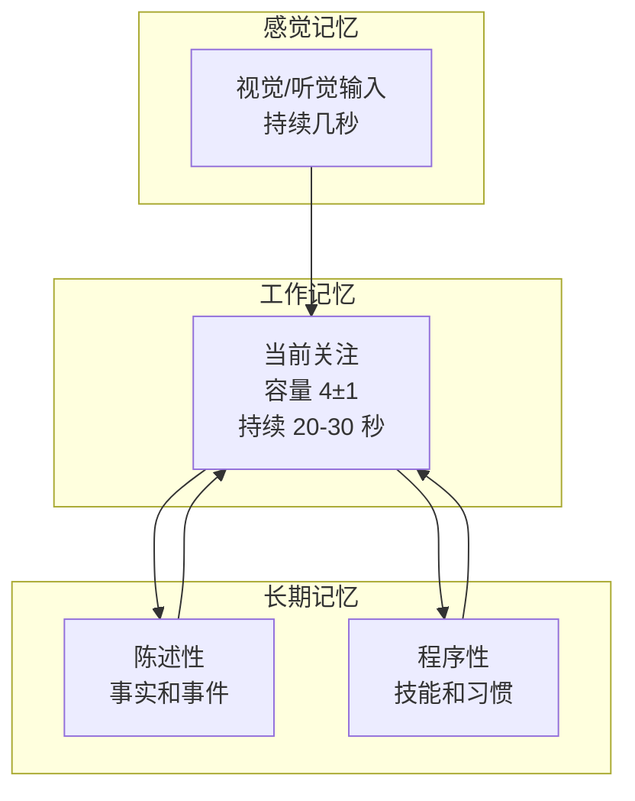
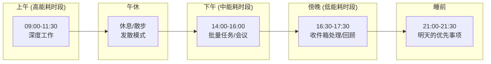

# 类脑工作流：像大脑一样工作

> 将 [[脑神经科学入门：从神经元到认知]] 中的大脑运作原理，映射到一套可执行的工作流中。

---

## 0. 核心理念

**人的大脑本身就是最精密的信息处理系统。** 与其逆着它工作（强迫自己像机器一样线性执行），不如顺着它的原理设计工作流。

> 核心公式：
> **好的工作流 = 放大大脑的优势（模式识别、联想、创造力）+ 弥补大脑的短板（工作记忆有限、分心、疲劳）**

---

## 第一章：大脑的 7 个核心特征 → 工作流原则

### 1.1 工作记忆容量有限（约 4 ± 1 个组块）

| 脑科学事实 | 工作流原则 |
|-----------|-----------|
| 工作记忆最多同时处理 **4 ± 1** 件事 | **单任务**——一次只做一件事 |
| 任务切换消耗能量（「切换成本」） | **批量处理**——同类任务集中完成 |
| 超出容量 → 效率暴跌 | **外部化**——把待办/素材写入外部系统，释放脑内存 |

> **这就是 Obsidian 的「收件箱」系统的神经科学基础**——把脑子里的东西「倒出来」写到外部，大脑就不需要费劲记着了。

#### 实操规则

```
❌ 坏习惯：
  写代码到一半 → 看到新邮件 → 切过去回 → 切回来继续写
  → 每次切换损失 ~20 分钟「重新进入状态」的时间
  → 工作记忆被多件事情碎片化

✅ 好习惯：
  写代码的时段（2小时）：关掉邮件、关掉微信、专注
  处理邮件的时段（30分钟）：集中回复
  休息时段：真正休息
```

### 1.2 注意力系统：两个互补模式

| 模式 | 脑区 | 特征 | 适合 |
|:----:|:----:|------|:----:|
| **集中模式 (Focus Network)** | 前额叶皮层 | 高能耗、排除干扰、深度处理 | 写作、编码、分析、数学 |
| **发散模式 (Default Mode Network)** | 默认模式网络 | 低能耗、联想漫游、远距离连接 | 创意、灵感、问题孵化 |

> 你不可能同时处于两种模式——**但最好的创意往往发生在发散模式中，而最好的执行发生在集中模式中。**

#### 实操规则

```yaml
工作流节奏：
  集中 90 分钟 → 休息 20 分钟 → 集中 90 分钟

在集中时段：
  - 关闭通知
  - 单一任务
  - 深度工作

在休息/发散时段：
  - 散步（最好的发散模式激活方式）
  - 洗澡
  - 做点不费脑的手工活
  - DO NOT: 刷手机（社交媒体同样消耗注意力）

关键洞察：
  如果你卡在某个问题上，
  "更努力地思考"（继续集中模式）往往没用。
  正确的做法：去做别的事，让发散模式接手。
```

### 1.3 记忆：多系统协同



**对工作流的启发**：

| 记忆系统 | 工作流中的对应 |
|---------|--------------|
| **感觉记忆** | 收件箱/闪念笔记——快速捕获，不做处理 |
| **工作记忆** | 当前任务——专注，外部化 |
| **长期记忆** | 知识库/原子笔记——结构化存储，方便检索 |
| **记忆巩固（睡眠）** | 每日回顾 + 每周整理——笔记在「睡觉」后链接更牢固 |

### 1.4 「预测编码」——大脑永远是预测模型

```
大脑不是被动接收信息，而是不断在做预测：
  看到一个模糊的影子 → 大脑预测那是一只猫
  走近一看 → 真是猫 → 预测正确，更新模型（无变化）
  走近一看 → 其实是只狗 → 预测错误 → 更新模型（学习发生）
```

**工作流启发**：

```
① 做事前先做预测
  这篇笔记写完后会给谁看？
  这个功能上线后用户会怎么用？
  → 有预测才能检测到「预测误差」→ 才能学习

② 定期检验预测
  回顾笔记时问自己：
  「我之前对这个问题的理解是 X，现在了解了更多信息，
   我是对的还是错的？需要更新笔记吗？」

③ 预测误差 = 学习信号
  如果某件事的结果完全出乎意料
  → 这是最重要的学习机会
  → 写一篇笔记记录「为什么我的预测错了」
```

### 1.5 Hebbian 学习：一起使用的连接会变强

> **"Cells that fire together, wire together."**

这是神经可塑性的基本原则——频繁同时激活的神经元之间，突触连接会增强。

**工作流启发**：

```
在 Obsidian 中：
  [[]] 链接 → 突触连接
  频繁同时打开的两篇笔记 → 它们之间的「神经连接」会增强

你应该：
  - 新笔记必须至少链接 2~3 篇已有笔记（建立新的突触连接）
  - 定期回顾和更新链接（强化已有连接）
  - 当你发现两个之前的孤岛知识可以连起来 → 这是最重要的学习时刻

在任务管理中：
  如果你总是在「焦虑」时打开「社交媒体」
  → 两者的神经连接在增强
  → 这就是「坏习惯」的神经生物学基础
  → 解法：打断这个连接，建立一个新的（如焦虑→散步）
```

### 1.6 大脑是「节能器官」

```
人脑只有体重的 2%，但消耗 20% 的总能量。
所以大脑有强烈的节能倾向：
  - 默认使用习惯（不费脑）
  - 抗拒改变和思考（费脑）
  - 喜欢清晰的指令（省能耗）
  - 选择最容易的选项（哪怕不是最优）
```

**工作流启发**：

```yaml
减少工作流本身的「摩擦」：
  - 捕获想法要足够快（快捷键、语音输入、手机）
  - 创建笔记要足够简单（模板降低思考成本）
  - 回顾要足够容易（设定固定时间，形成习惯）

利用习惯的力量：
  - 习惯 = 大脑的「自动驾驶」
  - 把关键动作变成习惯（每天 10 分钟回顾）
  - 习惯不需要意志力 → 节能

重要结论：
  工作流越「省脑子」，越能长期坚持。
  复杂的工作流 → 需要大量意志力 → 不可持续
  简单的工作流 → 习惯化 → 自动运转
```

### 1.7 睡眠是「系统维护时间」

```
睡眠时大脑在做（远不止休息）：
  - 记忆巩固：短期记忆 → 长期记忆
  - 突触修剪：清理不用的连接，为明天腾出空间
  - 废物清除：清除代谢废物（包括 β-淀粉样蛋白）
  - 创意连接：大脑在睡眠中形成远距离关联
```

**工作流启发**：

```yaml
每天结束时做「系统维护」：
  ① 收件箱清空（类似大脑的废物清除）
  ② 今天的笔记建立链接（记忆巩固）
  ③ 明天的优先任务写下（减少睡前反刍）
  
每周结束时做「深度维护」：
  ① 检查孤岛笔记（修剪不用连接）
  ② 更新 MOC（建立组织框架）
  ③ 反思「学到了什么」（促进远距离连接）

重要：
  不要在睡前处理复杂问题
  → 大脑需要无干扰的「维护时间」
  → 睡前刷手机 = 在系统维护期间打断它
```

---

## 第二章：将神经科学转化为每日工作流

### 一天的时间结构设计



### 每日工作流分步详解

#### 🟢 上午：深度工作（匹配前额叶皮层的高效期）

```yaml
原则：脑力最好的时候做最难的事
对应脑区：前额叶皮层（注意力、决策、执行）

步骤：
  1. 检查今天的「最优先 1 件事」（从昨晚写的清单）
  2. 关闭所有通知，进入单任务模式
  3. 工作 90 分钟 → 休息 5 分钟（站起来走动）
  4. 工作 90 分钟 → 午休

Obsidian 操作：
  - 在专心做项目时，可能完全不打开 Obsidian
  - 或有灵感快速记入收件箱（不打断工作流）
```

#### 🟡 午休：发散模式

```yaml
原则：让默认模式网络接管
对应脑区：默认模式网络（联想、创意、远距离连接）

步骤：
  1. 离开屏幕
  2. 散步最佳（激活发散模式最有效的方式）
  3. 或：简单家务、冥想
  4. ❌ 不要刷手机（社交媒体同样消耗注意力）

Obsidian 操作：
  - 不打开
  - 如果灵感涌现 → 语音记录或快速打字 → 扔回收件箱
```

#### 🟠 下午：批量处理

```yaml
原则：不需要全力聚焦的事务集中处理
对应脑区：基底节（习惯、程序化操作）

步骤：
  1. 批量处理：邮件、消息、简单任务
  2. 会议安排在此时间段
  3. 保持 45 分钟一批，中间有短休息

Obsidian 操作：
  - 整理上午的收件箱笔记
  - 批量建立 [[]] 链接
  - 处理每周 MOC 更新
```

#### 🔴 傍晚：系统维护

```yaml
原则：大脑「系统维护时间」——巩固、修剪、清空
对应脑区：海马体（记忆巩固）

步骤：
  1. 清空今日收件箱（每条决定去留）
  2. 快速回顾今天的笔记
  3. 写下明天的「最优先 1 件事」
  4. 结束工作

Obsidian 操作：
  - 打开每日日记 → 写「今天学到了什么」
  - 收件箱处理：每条闪念 → 建笔记/加链接/删除
  - 明天计划写入日记
```

#### 🌙 睡前一小时

```yaml
原则：降低认知负荷，为睡眠做准备

步骤：
  1. 远离蓝光屏幕（或开启夜间模式）
  2. 不要处理复杂问题
  3. 可以：读纸质书、写一篇日记
  4. ❌ 不要：刷社交、查邮件、思考明天要干嘛（已经写下来了）
```

---

## 第三章：工作流与大脑功能的映射总表

| 工作流动作 | 对应的大脑功能 | 神经科学原理 |
|-----------|---------------|-------------|
| **捕获到收件箱** | 感觉记忆 + 释放工作记忆 | 外部化降低认知负荷 |
| **单任务深度工作** | 前额叶皮层集中模式 | 减少任务切换的能耗 |
| **建立 `[[]]` 链接** | Hebbian 突触可塑性 | "一起使用的连接变强" |
| **创建原子笔记** | 长期记忆编码 | 一个概念一个节点 |
| **建立 MOC** | 海马体索引 | 组织框架 = 检索路径 |
| **休息/散步** | 默认模式网络激活 | 发散模式促进远距离连接 |
| **每日回顾** | 记忆巩固 | 巩固 = 从短期到长期 |
| **每周孤岛检查** | 突触修剪 | 不用连接变弱，清理 |
| **写下明天计划** | 释放工作记忆 | 睡前反刍减少 |
| **单任务** | 前额叶皮层执行功能 | 减少任务切换的前额叶能耗 |
| **批量处理** | 基底节习惯系统 | 同类事务用同一模式高效执行 |
| **预测 → 验证 → 更新** | 预测编码 | 学习 = 预测误差驱动 |
| **睡眠** | 记忆巩固 + 废物清除 | 系统维护时间 |

---

## 第四章：从「年度」到「分钟」的时间层级设计

```yaml
🎯 年度 / 季度（对应：前额叶皮层——远景规划）
  我这一年的核心方向是什么？
  Vault 中：建立 1-2 个新的领域 MOC
  
📅 月度（对应：记忆巩固——知识整合）
  这个月要建立什么知识结构？
  Vault 中：基于笔记写一篇输出
  
📆 每周（对应：突触修剪——维护优化）
  检查孤岛、更新 MOC、回顾
  Vault 中：10 分钟图谱维护
  
📋 每日（对应：工作记忆——执行）
  1 件最重要的事 + 收件箱清空
  Vault 中：日记 + 闪念处理
  
⏱ 即时（对应：感觉记忆——捕获）
  Obsidian 收件箱捕获
  快捷键 Cmd+N 直接写
```

---

## 第五章：与你的 Obsidian Vault 融合

### 你的 Vault 就是你的「外部大脑」

```yaml
内部大脑（生物学）        外部大脑（Obsidian Vault）
───────────────         ───────────────────
工作记忆（4±1）          → 收件箱/每日笔记（卸货区）
长期记忆（海马体）       → 原子笔记 + MOC（结构化存储）
记忆检索（联想）         → [[]] 链接 + 反向链接（自动关联提醒）
模式识别（新皮层）       → 图谱视图（视觉发现未知连接）
记忆巩固（睡眠）          → 每周回顾 + 更新链接
遗忘（突触修剪）         → 归档 / 删除 / 孤岛检查
注意力选择（前额叶）     → 任务优先级（1 件事原则）
```

### 你的脑内决策流程

```
你在工作 → 脑中闪过一个想法
    │
    ├── 跟当前任务有关？→ 快速记人收件箱，继续手头事
    │                      （释放工作记忆，不中断）
    │
    ├── 是个新知识点？→ 每日回顾时建一个原子笔记
    │                      （从感觉记忆→长期记忆）
    │
    ├── 跟已有知识有关？→ 建立 [[]] 链接
    │                      （Hebbian 学习——强化连接）
    │
    └── 是个新方向？→ 考虑建 MOC
                        （海马体索引——建立框架）
```

---

## 第六章：这套工作流 vs 常见生产力方法

| 常见方法 | 与之对应的类脑原则 | 神经科学依据 |
|---------|------------------|-------------|
| **GTD (Getting Things Done)** | 收件箱 = 释放工作记忆 | 工作记忆有限，外部化降低负荷 |
| **番茄工作法 (25 分钟间隔)** | 集中/发散交替 | 前额叶需要恢复，默认模式网络需要时间 |
| **深度工作 (Deep Work)** | 单任务长时段专注 | 前额叶需要 20+ 分钟进入状态 |
| **艾森豪威尔矩阵 (四象限)** | 优先级 = 前额叶执行功能 | 决策需要能量，所以要先区分重要/紧急 |
| **卡片笔记法 (Zettelkasten)** | 原子笔记 + 链接 | Hebbian 学习 + 长期记忆编码 |
| **间隔重复 (Spaced Repetition)** | 记忆巩固需要时间 | 睡眠、重复、检索强化突触 |
| **「吃青蛙」（先做最难的事）** | 前额叶在早上能量最高 | 决策和自控力是消耗品，越用越少 |

> **Obsidian + 类脑工作流 = 数字化的 Zettelkasten + GTD + 深度工作的融合体**

---

## 第七章：检查清单——你的工作流「健康度」

每周自检，看你的工作流是否「符合大脑的设计」：

```
认知负荷
□ 收件箱是否接近清空？（而不是攒了几十上百条）
□ 今天是否有一段时间是单任务的？
□ 是否把「要做的事」写到了外部，而不是靠脑子记？

注意力管理
□ 今天是否有 2 个以上的「深度工作」时段？
□ 休息时是否真的在休息（不是刷手机）？
□ 是否在「集中模式」和「发散模式」之间有意识切换？

记忆与学习
□ 今天写的笔记是否有 [[]] 链接？（至少 2 个）
□ 今天是否回顾了以前的笔记？
□ 有没有发现「两个之前没关联的知识点」之间的新连接？

能量管理
□ 是否在精力最好的时段做了最难的事？
□ 下午的低谷期是否安排了简单任务？
□ 睡前是否停止处理复杂信息？

维护
□ 今天是否有做「明天计划」？（释放睡前大脑）
□ 这周是否有做图谱孤岛检查？（突触修剪）
□ 这周是否有一篇输出？（知识整合检验）
```

---

## 🔗 关联笔记

- [[脑神经科学入门：从神经元到认知]] ← 神经科学基础
- [[机器学习与脑神经科学的关系]] ← 大脑 vs 人工系统的对比
- [[Obsidian完美使用工作流]] ← 在不考虑大脑的情况下设计的通用工作流
- [[Obsidian知识管理的底层逻辑]] ← 底层原则
- [[奥术师工作法]]（如存在）← 如果已经有个人工作流笔记，可以对比

---

*最后更新：2026-07-12*
