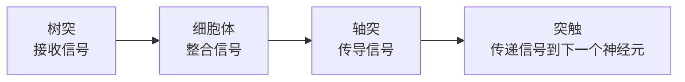

# 脑神经科学入门：从神经元到认知

> 脑神经科学（Neuroscience）是研究**神经系统**的科学——从微观的单个神经元如何放电，到宏观的大脑如何产生意识、记忆和决策。

---

## 1. 一句话定义

> **脑神经科学 = 关于「大脑如何工作」的全部科学。**

它不是一个单一的学科，而是**从分子到行为**多个层次研究的集合：

```
分子水平      ──→  神经元如何传递信号
细胞水平      ──→  不同类型的神经细胞
神经网络水平  ──→  一组神经元如何协同工作
脑区水平      ──→  不同脑区域负责什么功能
行为水平      ──→  大脑如何产生行为
认知水平      ──→  记忆、语言、意识如何产生
```

---

## 2. 脑神经科学的六大子领域

### 分子与细胞神经科学

```
研究什么：
  - 神经递质（多巴胺、血清素、乙酰胆碱）如何工作
  - 离子通道如何控制神经元的兴奋性
  - 突触可塑性——学习和记忆的分子基础

与你的相关性：
  - 阿尔兹海默症的 β-淀粉样蛋白和 tau 蛋白病理
  - 抗抑郁药/抗精神病药的分子靶点
```

### 系统神经科学

```
研究什么：
  - 视觉系统：从视网膜到视觉皮层的信息处理
  - 运动系统：大脑如何控制肌肉运动
  - 奖励系统：多巴胺通路与动机

与你的相关性：
  - 理解「大脑如何编码信息」→ 启发了深度学习中的卷积神经网络
```

### 认知神经科学

```
研究什么：
  - 记忆：短期记忆 vs 长期记忆，海马体的作用
  - 语言：布罗卡区（语言生成）vs 韦尼克区（语言理解）
  - 决策：前额叶皮层如何评估和选择
  - 意识：最前沿也最困难的问题

与你的相关性：
  - 之前讨论的「认知储备」理论就来自这里
  - 理解注意力机制——注意力是认知神经科学的核心概念之一
```

### 发育神经科学

```
研究什么：
  - 大脑从胚胎到成年的发育过程
  - 关键期：为什么儿童学语言比成人快？
  - 神经可塑性：大脑如何自我重塑

经典发现：
  - "use it or lose it"——不用的神经连接会被修剪
  - 这和你 Obsidian 中「不用的笔记会变成孤岛」是同一道理
```

### 临床神经科学

```
研究什么：
  - 神经退行性疾病：阿尔兹海默症、帕金森病、亨廷顿病
  - 精神疾病：抑郁症、精神分裂、焦虑症
  - 脑损伤、中风、脊髓损伤

与你的相关性：
  - 上一份笔记 [[阿尔兹海默症发病率与受教育程度的关系]] 就属于这个领域
```

### 计算神经科学

```
研究什么：
  - 用数学模型描述神经元的电活动
  - 用计算机模拟神经网络
  - 大脑的计算理论——大脑在「算」什么？

与你的相关性：
  - **这是神经科学和 AI 的交汇点**
  - 深度学习中的「神经网络」一词就来自这里
  - 但注意：人工神经网络 ≠ 真实神经网络（下面详说）
```

---

## 3. 脑神经科学的核心概念

### 3.1 神经元——大脑的基本单位



**关键数字**：
- 人脑约有 **860 亿**个神经元
- 每个神经元平均有 **~7,000** 个突触连接
- 突触总数：约 **600 万亿**（比银河系的恒星数还多 3 个数量级）

### 3.2 突触可塑性——学习和记忆的生物学基础

```yaml
Hebbian 规则（1949）：
  "Cells that fire together, wire together."
  一起放电的神经元，会连接得更强。

长时程增强 (LTP)：
  高频刺激 → 突触连接增强 → 记忆形成

长时程抑制 (LTD)：
  低频刺激 → 突触连接减弱 → 遗忘

这与你的 Obsidian 知识网络类比：
  [[]] 链接用得越多 → 连接越强（LTP）
  从不回顾的笔记 → 连接减弱（LTD）
```

### 3.3 大脑的组织层级

```
大脑皮层（灰质）
  ├── 额叶：决策、规划、人格
  ├── 顶叶：空间感知、触觉
  ├── 颞叶：听觉、语言理解、记忆（海马体在这里）
  └── 枕叶：视觉处理

皮层下结构
  ├── 海马体：记忆形成（阿尔兹海默症最先受损的区域）
  ├── 杏仁核：情绪（特别是恐惧）
  ├── 基底核：运动控制（帕金森病在这里）
  └── 丘脑：感觉信息的中继站
```

### 3.4 神经递质——大脑的化学信使

| 神经递质 | 主要功能 | 相关疾病/药物 |
|---------|---------|--------------|
| **多巴胺** | 奖励、动机、运动控制 | 帕金森（↓）、精神分裂（↑）、成瘾 |
| **血清素** | 情绪、食欲、睡眠 | 抑郁症（SSRI 类药物靶点） |
| **乙酰胆碱** | 注意力、记忆、肌肉收缩 | 阿尔兹海默症（↓↓） |
| **谷氨酸** | 主要兴奋性递质、学习（LTP） | 中风时过度释放导致神经毒性 |
| **GABA** | 主要抑制性递质 | 焦虑症（苯二氮䓬类药物靶点） |

---

## 4. 脑神经科学 vs 人工智能：关键区别

这是对你「学 AI」最相关的一个部分。

### 它们共享的名字——「神经网络」

```yaml
人工神经网络（你正在学的）：
  - 节点是简单的数学函数
  - 权重是数值
  - 训练 = 调整权重
  - 反向传播算法

真实神经网络（脑神经科学研究的）：
  - 节点是复杂的生物细胞
  - 连接是化学突触（比权重复杂得多）
  - 学习 = 突触可塑性（LTP/LTD）
  - 没有等价的反向传播
```

### 六个关键区别

| 维度       | 人工神经网络              | 真实大脑                   |
| -------- | ------------------- | ---------------------- |
| **速度**   | 纳秒级（电子）             | 毫秒级（离子+化学）→ 慢 100 万倍   |
| **并行度**  | 顺序处理（即使 GPU 也是受限并行） | **极度并行**（860 亿个单元同时工作） |
| **能耗**   | GPT-4 训练估计 ~50 GWh  | 人脑 **~20W**（一个节能灯泡）    |
| **学习方式** | 反向传播 + 海量标注数据       | 单样本/小样本学习，无监督为主        |
| **可解释性** | 黑箱（虽然研究很多）          | 也是黑箱（但研究工具不同）          |
| **容错性**  | 权重损坏 → 性能急剧下降       | 每天损失数千神经元 → 正常运作       |

### 相互启发的关系

```yaml
神经科学 → AI：
  - 感知机 (1958) ← 受神经元启发
  - CNN (1980s) ← 受猫视觉皮层实验启发
  - 注意力机制 (2017) ← 受认知注意力启发
  - 强化学习 ← 受多巴胺奖励系统启发

AI → 神经科学：
  - 用深度学习模型来模拟大脑信息处理
  - 用 AI 分析脑成像数据
  - 用 AI 预测蛋白质结构（包括神经相关蛋白）

最前沿：两者正在融合为「神经AI」(NeuroAI)
```

---

## 5. 脑神经科学如何解释你之前的笔记

### 5.1 教育保护大脑的神经科学基础

上一份笔记 [[阿尔兹海默症发病率与受教育程度的关系]] 中的「认知储备」，其神经基础是：

```yaml
① 突触密度增加：
  学习 = 形成新的突触连接
  受教育时间越长 → 突触密度越高 → 神经回路有更多冗余

② 神经通路替代：
  当一条通路受损（如淀粉样斑块阻塞），
  高教育者更容易启用替代通路来补偿

③ "认知储备"不是理论假设——
  尸检研究证实：相同程度的病理改变，
  高教育者临床症状更轻
```

### 5.2 Obsidian 知识管理与大脑的隐喻

| 大脑中的概念 | Obsidian 中的对应 |
|------------|-----------------|
| 神经元 | 一篇原子笔记 |
| 突触 | `[[]]` 链接 |
| Hebbian 学习（一起放电的神经元连在一起） | 被你频繁「同时打开」的笔记关联更强 |
| 突触修剪（不用的连接消失） | 从不维护的链接变成断链或孤岛 |
| 海马体（记忆索引） | MOC（内容地图） |
| 长时程增强（LTP） | 反复回顾和更新的笔记 |
| 记忆巩固 | 从收件箱 → 原子笔记 → MOC 的渐进式整理 |
| 神经元死亡 | 弃用的笔记（正常，每天都有新笔记） |

> 这不是牵强附会——**你用一个外部知识网络（Obsidian）来扩展内部知识网络（大脑）**，两种网络遵循相似的原理。

---

## 6. 脑神经科学的研究方法

### 技术工具

| 技术 | 看什么 | 分辨率 | 局限性 |
|------|-------|:------:|--------|
| **fMRI（功能磁共振）** | 脑区活动（血流变化） | 空间高 / 时间低 | 不能看单个神经元 |
| **EEG（脑电图）** | 脑电波节律 | 时间高 / 空间低 | 难以定位精确来源 |
| **PET（正电子扫描）** | 代谢活动、分子分布 | 中等 | 有辐射 |
| **双光子显微镜** | 单个神经元、突触 | 极高 | 需要动物，不能用于人 |
| **光遗传学** | 用光精确控制特定神经元 | 精确到细胞类型 | 需要基因改造，仅动物 |

### 研究方法逻辑

```
描述性研究：这个脑区在做什么任务时激活？
  例：fMRI 显示海马体在回忆时激活

损伤研究：这个脑区坏了会怎样？
  例：H.M. 病人切除海马体后无法形成新记忆
      → 证明了海马体在记忆形成中的关键作用

干预研究：改变这个脑区会怎样？
  例：光遗传学激活小鼠特定神经元 → 产生虚假记忆
  例：经颅磁刺激（TMS）抑制某脑区 → 认知变化
```

**神经科学史上最重要的病人——H.M.**

```
1953 年，27 岁的 H.M. 为治疗癫痫切除了双侧海马体。
结果：
  - 癫痫好转
  - 智力正常，能正常对话
  - 但无法形成任何新的长期记忆
  - 每天见到医生都像第一次见面
  - 能学会新技能（如画五角星）但不记得学过

这个病例：
  - 证明了海马体对记忆形成的必要性
  - 区分了「陈述性记忆」（忘记）和「程序性记忆」（保留）
  - 奠定了现代记忆研究的基石
```

---

## 7. 脑神经科学与 AI 的交汇——你感兴趣的交叉点

### 7.1 注意力机制的神经科学起源

```yaml
你在学 Transformer 中的「注意力机制」，
它的名字和灵感来源就是认知神经科学中的「注意力」：

大脑中的注意力：
  - 你不会同时处理所有视觉输入
  - 你「选择性地关注」某些信息而忽略其他
  - 顶叶和前额叶皮层协同实现注意力的导向

Transformer 的注意力：
  - 模型不会同等关注所有 token
  - 通过注意力分数「选择性地关注」相关 token
  - 这跟大脑的机制惊人地相似
```

### 7.2 你可以关注的交叉领域

| 领域 | 说明 | 适合你的切入点 |
|------|------|--------------|
| **神经形态计算** | 仿造大脑架构的芯片（如 Intel Loihi） | 硬件层面，可以先了解概念 |
| **类脑 AI** | 受大脑启发的新型 AI 架构 | 了解现有深度学习的局限 |
| **认知架构** | 模拟人类认知过程的 AI 系统 | 跟你的知识管理兴趣很契合 |
| **脑机接口 (BCI)** | 大脑直接与计算机通信 | 技术前沿，目前临床应用为主 |

---

## 8. 一句话锐评

> **脑神经科学是「唯一一门研究对象和研究工具是同一件事」的学科**——大脑用大脑来研究大脑。它对 AI 学习者的价值不在于提供可以直接复制到代码中的算法，而在于让你理解「智能」这个目标是什么样子的：一个 20W、860 亿神经元、极度并行的系统。知道了真正的大脑是什么样，你就知道当前 AI 的路走到了哪里，以及哪些路还没走。

---

## 🔗 关联笔记

- [[阿尔兹海默症发病率与受教育程度的关系]] ← 临床神经科学案例
- [[图论入门：从Obsidian到AI]] ← 神经网络可视为图，大脑可视为图
- [[Obsidian知识管理的底层逻辑]] ← 外部知识网络与大脑网络的类比
- [[Transformer 架构]]（如存在）← 注意力机制的神经科学起源

---

## 📚 推荐入门资源

- **书籍**：《 Neuroscience: Exploring the Brain》（Mark Bear）— 经典教材
- **书籍**：《认知神经科学》（Michael Gazzaniga）— 认知方向
- **课程**：HarvardX 的 CS50x 脑科学入门（免费）
- **课程**：MIT 9.01 神经科学导论（OpenCourseWare）
- **文章**：[Neuroscience for AI](https://nba.uth.tmc.edu/neuroscience/) (免费在线教材)

---

*最后更新：2026-07-12*
