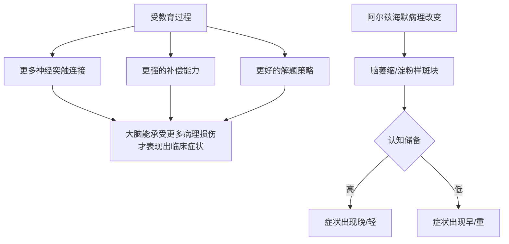
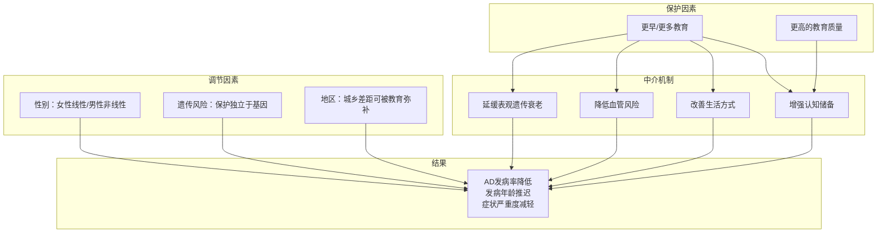

# 阿尔兹海默症发病率与受教育程度的关系

> 基于 2024–2026 年最新研究的系统综述

---

## 1. 核心结论（一句话）

> **受教育程度越高，阿尔兹海默症发病风险越低。** 这是一个在多个国家、数十万人群中反复验证的、独立于遗传风险的、很可能具有因果关系的保护因素。

---

## 2. 关键数据

### 2.1 国内数据

根据中国发布的《老年期痴呆防治百问百答》，受教育年限与痴呆发病率呈明显梯度关系：

| 受教育程度 | 痴呆发病率 |
|-----------|:---------:|
| ≤8 年（小学及以下） | **20.4%** |
| 9–11 年（初中） | **15.0%** |
| 高中 | **13.2%** |
| 大学及以上 | **11.2%** |

> 大学及以上学历者发病率比小学及以下低近一半。

来源：[中国《老年期痴呆防治百问百答》](http://mp.weixin.qq.com/s?__biz=MzIzNTAxNjMwMA==&mid=2651896094&idx=1&sn=2ea019598a9e82c1e8f8d453a3029777)

### 2.2 国际大样本研究

| 研究 | 样本量 | 核心发现 |
|------|:------:|---------|
| **孟德尔随机化研究** (2025, *Neurology Genetics*) | 数十万人 | 每多 1 年教育，AD 风险降低 **~30%**（OR 0.70）；校正偏倚后仍显著（OR 0.76） |
| **UK Biobank 队列研究** | 318,535 人 | 高教育 vs 低教育：AD 风险降低 **30%**（OR 0.70）；低遗传风险+高教育组风险降低 **>90%** |
| **意大利研究** | 778 人（59岁以上） | 文盲患痴呆风险是受教育者的 **16 倍**；体力劳动者是脑力劳动者的 **2–3 倍** |
| **美国 HRS 数据** (2000–2018) | 全国代表性样本 | 高中以下教育是痴呆最强的独立预测因子（HR = **2.64**） |
| **城乡差异 Meta 分析** (2025) | 584,863 人（19项研究） | 低教育地区（≤8.1年）农村痴呆显著更高（OR 1.43）；高教育地区城乡差异消失 |

来源：
- [Neurology Genetics 孟德尔随机化研究](https://www.neurology.org/doi/full/10.1212/NXG.0000000000200307)
- [UK Biobank 研究](https://www.ukbiobank.ac.uk/publications/education-counteracts-the-genetic-risk-of-alzheimers-disease-without-an-interaction-effect/)
- [城乡差异 Meta 分析](https://pmc.ncbi.nlm.nih.gov/articles/PMC12501328/)

---

## 3. 这种保护效应是「因果」还是「相关」？

### 关键结论：很可能是因果关系

2025 年 Upjohn Institute 使用「边界估计法」（bounding method）发现：

| 干预 | 效果 |
|------|------|
| 美国：高中 → 大学毕业 | 痴呆发病率降低 **4–14%** |
| 中低收入国家：无学 → 小学毕业 | 记忆分数提升最高达 **28%** |

**证据链**：
- 孟德尔随机化（利用基因变异作为教育年限的工具变量）证实因果方向
- 控制家庭背景、收入等混杂因素后，保护效应仍然存在
- 教育质量（而非仅年限）也独立影响痴呆风险

来源：[Upjohn Institute 研究](https://research.upjohn.org/cgi/viewcontent.cgi?article=1359&context=empl_research)

---

## 4. 作用机制：为什么教育能保护大脑？

### 4.1 认知储备理论（主流解释）

> **教育不是在防止大脑病变，而是在让大脑更耐损耗。**



**两个关键概念的区别**：

| 概念 | 含义 |
|------|------|
| **脑储备 (Brain Reserve)** | 大脑的硬件——神经元数量、突触密度、脑容量 |
| **认知储备 (Cognitive Reserve)** | 大脑的软件——补偿能力、策略多样性、效率 |

**教育主要增强的是「认知储备」**——即使病理改变相同，高教育者的临床症状出现得更晚、更轻。

### 4.2 间接路径：生活方式中介

2025 年 HUNT 研究（*BMC Public Health*）发现，教育通过生活方式中介了 **11.6–19.5%** 的保护效应：

| 中介因素 | 解释比例 |
|---------|:--------:|
| 健康风险因素（高血压、糖尿病、心血管病、抑郁） | 6.9–13.1% |
| 生活方式因素（吸烟、缺乏运动） | 4.1–5.0% |
| **合计** | **11.6–19.5%** |

**解释**：高教育者更倾向于健康饮食、规律运动、更好的医疗条件、更少吸烟——这些本身就降低痴呆风险。

来源：[HUNT 研究 - BMC Public Health](https://bmcpublichealth.biomedcentral.com/counter/pdf/10.1186/s12889-025-22592-9.pdf)

### 4.3 表观遗传机制

2025 年研究（*GeroScience*）发现：
- **6–8%** 的教育-痴呆关联通过 DNA 甲基化年龄加速介导
- **23.6–29.2%** 来自低教育与生物老化的相加交互作用

> 也就是说，教育可能在「分子层面」延缓了大脑衰老的速度。

来源：[Health and Retirement Study - GeroScience](https://link.springer.com/article/10.1007/s11357-024-01356-0)

---

## 5. 关键调节因素

### 5.1 性别差异

2024 年研究（17,671 名老年人，美国 AD 中心数据）：

| 性别 | 教育-痴呆关系 | 低教育风险 |
|:----:|-------------|:----------:|
| 女性 | **线性**——更多教育持续降低风险 | AD 风险 HR 最高 **2.11** |
| 男性 | **非线性**——12 年后效果平台期 | AD 风险 HR 高达 **3.45**，也对非 AD 痴呆有影响 |

**解释**：这可能与社会角色分化有关——受教育程度低的男性更容易暴露在职业危害（脑外伤、化学物质）中，多种因素叠加增加了全因痴呆风险。

来源：[PMC 研究 - Sex differences](https://pmc.ncbi.nlm.nih.gov/articles/PMC11105760/)

### 5.2 遗传风险

UK Biobank 研究的重要发现：

```
低遗传风险 + 高教育 → 风险降低 >90%（相对于高风险+低教育组）
高遗传风险 + 高教育 → 保护效应依然存在（无交互作用，p = 0.359）
```

**关键含义**：教育的保护作用**独立于基因**——即使家族史阳性，教育仍能降低发病风险。

### 5.3 教育质量 vs 教育年限

2025 年 PLOS ONE 研究（Ailshire 等）：

- 在教育质量**高**的州接受教育者，痴呆风险显著更低（RRR 0.81）
- 教育质量的差异**完全解释了美国南部地区的痴呆高发现象**
- 教育质量对低教育水平者的影响更大

> **不只是「上了多少年学」，还包括「学得好不好」**。

来源：[PLOS ONE - 教育质量与区域差异](https://journals.plos.org/plosone/article?id=10.1371/journal.pone.0332410)

---

## 6. 公共卫生意义

### 6.1 Lancet 痴呆预防委员会（2024）

将**低教育水平**列为全生命周期 14 个可调控痴呆风险因素之一，且是**早年阶段最重要的因素**。

```
早年（<45岁）    →   低教育水平
中年（45–65岁） →   听力损失、高血压、肥胖、饮酒过量、脑外伤
晚年（>65岁）    →   吸烟、抑郁、缺乏社交、糖尿病、空气污染
```

### 6.2 可归因分数（PAF）

估计如果消除低教育因素，全球阿尔兹海默症病例可减少：

- 全球：约 **7–8%**
- 中国等中低收入国家：可能更高（因低教育人口比例大）

### 6.3 政策启示

```
① 提高教育普及率（尤其是女性教育和农村教育）
② 提升教育质量（而不仅仅是年限）
③ 终身学习——中年和晚年的认知活动也有保护作用
④ 针对低教育人群的健康行为干预（弥补间接路径的损失）
```

---

## 7. 研究局限与开放问题

| 局限 | 说明 |
|------|------|
| **参与偏倚** | 高教育人群更愿意参与研究，可能导致低估或高估效应 |
| **生存偏倚** | 低教育人群中年死亡率更高，活到老年的可能是「健康幸存者」 |
| **痴呆诊断的文化差异** | 高教育人群在认知测试中可能被延迟诊断（表现阈值更高） |
| **中低收入国家数据不足** | 大部分研究来自欧美，中国/非洲/东南亚的数据仍有限 |
| **非线性关系的精确阈值** | 男性的 12 年「平台期」是否普遍？是否存在最佳教育年限？ |

---

## 8. 总结：数据全景



### 最核心的三句话

> ① **教育是终身保护**——早年的教育积累，在 60 岁后仍然显著保护大脑。
>
> ② **保护是因果性的**——不是「高教育的人本来就聪明所以不容易得病」，而是教育的过程本身在构建大脑的韧性。
>
> ③ **教育不是唯一因素，但它是杠杆效应最大的因素之一**——它不仅直接增强认知储备，还通过影响此后几十年的生活方式、职业、医疗条件间接降低风险。

---

## 9. 对你个人 Vault 的启发

> 你正在用 Obsidian 构建的**知识网络本身就是认知储备的一种形式**。

- 每篇原子笔记 → 一个神经突触
- 每个 `[[]]` 链接 → 突触连接
- 每个 MOC → 神经回路的「索引」
- 图谱中密集的知识簇 → 强化的神经通路

**终身学习 + 主动建立知识连接，正是提高「认知储备」在当代最直接的实践之一。**

---

## 🔗 关联笔记

- [[图论入门：从Obsidian到AI]] — 知识的连接结构与大脑的网络结构都在研究「连接」
- [[Obsidian知识管理的底层逻辑]] — 认知储备与外部知识网络的类比
- [[MOC-神经科学]]（如存在）

---

## 📚 参考文献

1. [Disentangling the Causal Effects of Education on AD - Neurology Genetics, 2025](https://www.neurology.org/doi/full/10.1212/NXG.0000000000200307)
2. [Education Counteracts Genetic Risk of AD - UK Biobank](https://www.ukbiobank.ac.uk/publications/education-counteracts-the-genetic-risk-of-alzheimers-disease-without-an-interaction-effect/)
3. [Rural-Urban Disparities in AD - Meta-analysis, 2025](https://pmc.ncbi.nlm.nih.gov/articles/PMC12501328/)
4. [Non-linear Effects of Education by Sex - PMC, 2024](https://pmc.ncbi.nlm.nih.gov/articles/PMC11105760/)
5. [Mediators of Educational Differences - HUNT Study, BMC Public Health, 2025](https://bmcpublichealth.biomedcentral.com/counter/pdf/10.1186/s12889-025-22592-9.pdf)
6. [Education and DNA Methylation Age - GeroScience, 2025](https://link.springer.com/article/10.1007/s11357-024-01356-0)
7. [Causal Effects of Education on Dementia - Upjohn Institute, 2025](https://research.upjohn.org/cgi/viewcontent.cgi?article=1359&context=empl_research)
8. [Education Quality and Regional Variation - PLOS ONE, 2025](https://journals.plos.org/plosone/article?id=10.1371/journal.pone.0332410)
9. [中国老年期痴呆防治百问百答](http://mp.weixin.qq.com/s?__biz=MzIzNTAxNjMwMA==&mid=2651896094&idx=1&sn=2ea019598a9e82c1e8f8d453a3029777)

---

*最后更新：2026-07-12*
